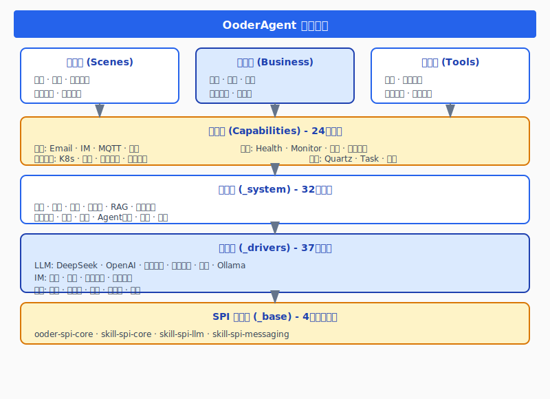
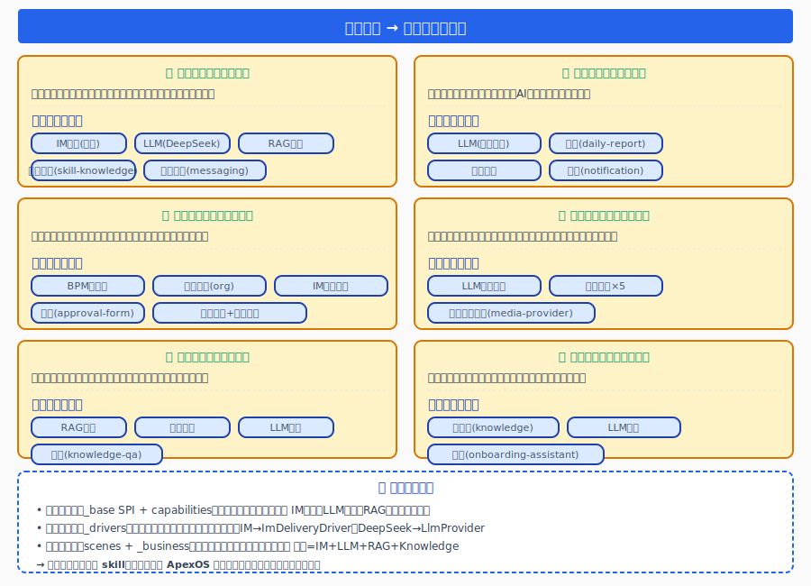
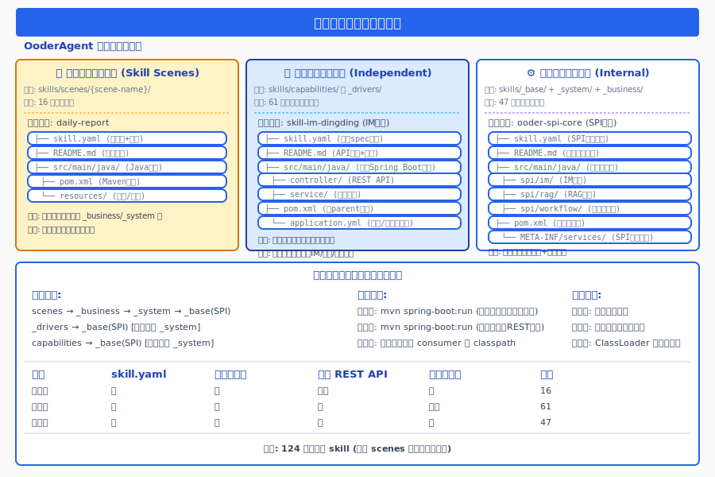
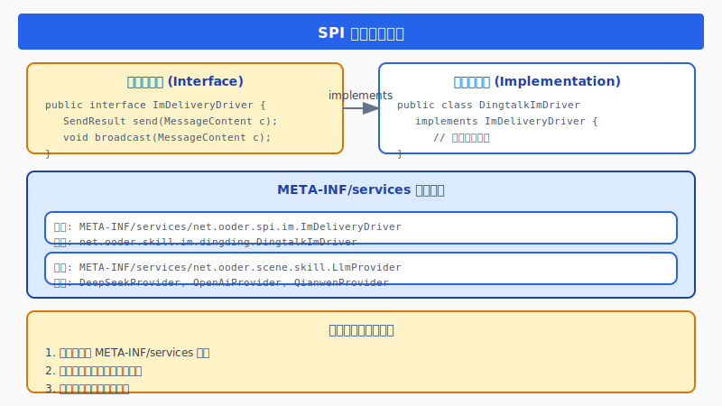
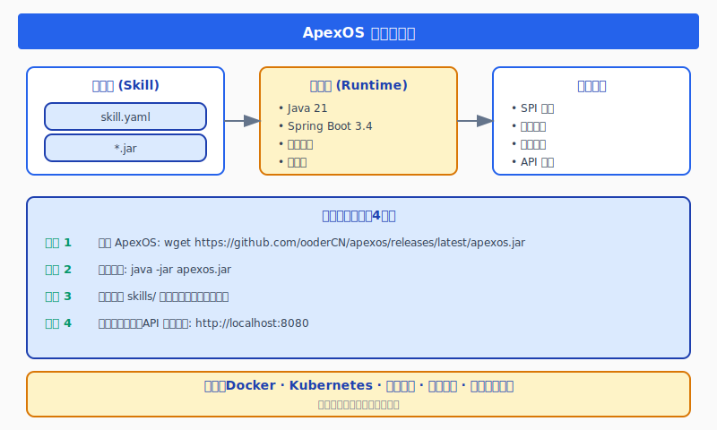
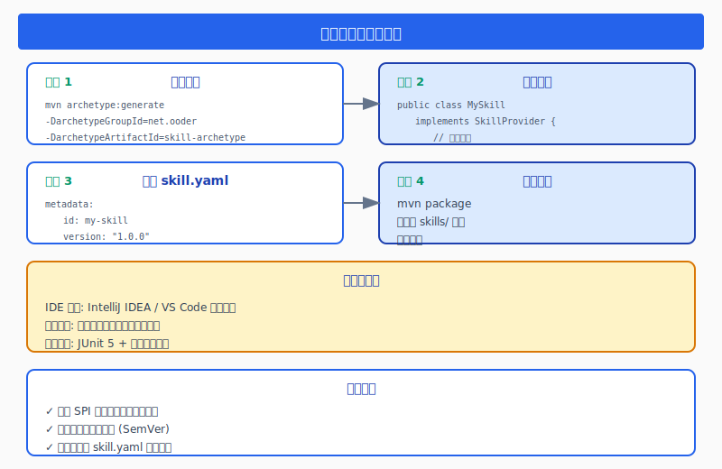
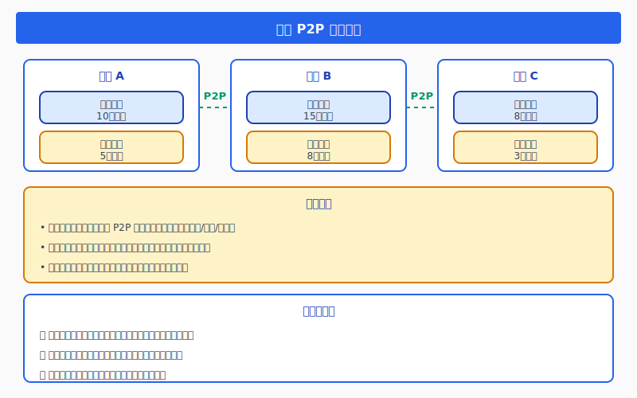
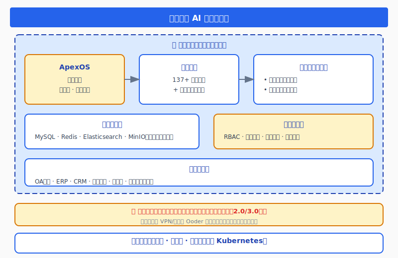

# OoderAgent：零部署构建企业级 AI Agent 能力生态

<p align="center">
  
</p>

<p align="center">
  <strong>MIT 开源</strong> · <strong>137+ 标准化技能</strong> · <strong>零部署开箱即用</strong> · <strong>P2P 能力分享</strong>
</p>

---

## 摘要

OoderAgent 是一个革命性的企业级 AI Agent 平台，基于**技能架构（Skills Architecture）**设计理念，让企业能够**零部署、零安装**即可构建自主私有的 AI 能力库。平台内置 **137+ 种标准化技能**，涵盖 LLM 集成、业务流程、知识管理、通讯协作等全场景，开箱即用，支持 P2P 能力分享，真正实现 AI 能力的民主化。

---

## 目录

- [一、核心架构](#一核心架构)
- [二、能力库全景](#二能力库全景137种技能覆盖)
- [三、技能库分类深度展开](#三技能库分类深度展开)
- [四、用户场景](#四用户场景技能如何组合)
- [五、场景分类详解](#五场景分类详解三种形态与文件结构)
- [六、技术原理](#六技术原理深度解析)
- [七、自定义技能开发](#七自定义技能开发)
- [八、企业私有化部署](#八构建企业私有能力库)
- [九、快速开始](#九快速开始)
- [十、总结与展望](#十总结与展望)

---

## 一、核心架构

### 1.1 技能架构设计理念

OoderAgent 采用**技能即服务（Skills-as-a-Service）**架构，将复杂的 AI 能力抽象为可插拔的技能模块：

```
┌─────────────────────────────────────────────────────────────────┐
│                     OoderAgent 平台架构                          │
├─────────────────────────────────────────────────────────────────┤
│                                                                 │
│   ┌─────────────┐    ┌─────────────┐    ┌─────────────┐        │
│   │   场景层     │    │   业务层     │    │   工具层     │        │
│   │  (Scenes)   │◄──►│ (Business)  │◄──►│   (Tools)   │        │
│   └──────┬──────┘    └──────┬──────┘    └──────┬──────┘        │
│          └──────────────────┼──────────────────┘               │
│                             ▼                                  │
│   ┌─────────────────────────────────────────────────────┐     │
│   │              能力层 (Capabilities)                   │     │
│   │   通信 · 监控 · 基础设施 · 调度 · 搜索 · 认证        │     │
│   └─────────────────────────┬───────────────────────────┘     │
│                             ▼                                  │
│   ┌─────────────────────────────────────────────────────┐     │
│   │              系统层 (_system)                        │     │
│   │   认证 · 配置 · 工作流 · RAG · 知识管理 · 消息服务   │     │
│   └─────────────────────────┬───────────────────────────┘     │
│                             ▼                                  │
│   ┌─────────────────────────────────────────────────────┐     │
│   │              驱动层 (_drivers)                       │     │
│   │   LLM · IM · 媒体 · 支付 · 组织架构 · 文件系统 · BPM │     │
│   └─────────────────────────┬───────────────────────────┘     │
│                             ▼                                  │
│   ┌─────────────────────────────────────────────────────┐     │
│   │              SPI 基础层 (_base)                      │     │
│   │   统一接口定义 · 服务发现 · 插件机制                 │     │
│   └─────────────────────────────────────────────────────┘     │
└─────────────────────────────────────────────────────────────────┘
```

### 1.2 核心特性

| 特性 | 说明 | 优势 |
|------|------|------|
| **零部署** | ApexOS 开箱即用 | 无需安装，启动即用 |
| **MIT 开源** | 完全开源免费 | 企业自主可控 |
| **137+ 技能** | 覆盖全业务场景 | 开箱即用 |
| **SPI 架构** | 标准化接口 | 易于扩展 |
| **P2P 分享** | 技能点对点共享 | 生态共建 |

### 1.3 项目目录结构

```
E:\github\ooder-skills\
├── skills/                        # ★ 核心技能库（137+ 个模块）
│   ├── _base/                     # SPI 基础层（4个）
│   ├── _drivers/                  # 驱动层（37个 - LLM/IM/媒体/支付/BPM/VFS/Org）
│   ├── _system/                   # 系统层（32个）
│   ├── _business/                 # 业务层（11个）
│   ├── capabilities/              # 能力层（24个 - 通信/监控/基础设施/调度/搜索/认证/LLM）
│   ├── scenes/                    # 场景层（16个业务场景）
│   ├── tools/                     # 工具层（10个）
│   ├── config/                    # 全局配置
│   ├── diagram_*.svg              # 架构图表（9+ 张 SVG）
│   └── OODER_AGENT_UPGRADE_BLOG.md  # 完整博文
│
├── app/                           # 应用模块
│   ├── skill-common/              # 公共依赖
│   ├── skill-hotplug-starter/     # 热插拔启动器
│   └── skill-org-base/            # 组织基础
│
├── templates/                     # 技能模板
├── skill-index/                   # 技能索引定义
├── scripts/                       # 构建/打包脚本
├── docs/                          # 设计文档 & 规范
├── archive/                       # 历史归档
├── .github/workflows/             # CI/CD
├── pom.xml                        # Maven 父 POM
├── LICENSE                        # MIT License
└── README.md                      # 本文件
```

---

## 二、能力库全景：137种技能覆盖

### 2.1 技能分类统计

OoderAgent 能力库包含 **137 个标准化技能模块**，分布在 7 大层级：

| 层级 | 数量 | 占比 | 核心能力 |
|------|------|------|----------|
| **SPI 基础层** (`_base`) | 4 | 2.9% | 统一接口、服务发现 |
| **驱动层** (`_drivers`) | 37 | 27.0% | 外部系统集成 |
| **系统层** (`_system`) | 32 | 23.4% | 核心系统服务 |
| **能力层** (`capabilities`) | 24 | 17.5% | 可复用基础能力 |
| **场景层** (`scenes`) | 16 | 11.7% | 业务场景封装 |
| **业务层** (`_business`) | 11 | 8.0% | 业务逻辑处理 |
| **工具层** (`tools`) | 10 | 7.3% | 辅助工具 |


### 2.2 驱动层：全平台集成能力

#### LLM 驱动矩阵（8个）

| 驱动 | 提供商 | 部署方式 |
|------|--------|----------|
| DeepSeek | 深度求索 | 云端 API |
| OpenAI | OpenAI | 云端 API |
| 通义千问 | 阿里云 | 云端 API |
| 文心一言 | 百度 | 云端 API |
| 火山引擎 | 字节跳动 | 云端 API |
| Ollama | 开源社区 | 本地部署 |
| LLM Base | 抽象层 | - |
| LLM Monitor | 监控服务 | - |

#### 其他驱动类别

| 类别 | 数量 | 说明 |
|------|------|------|
| **IM 通讯** | 4 | 钉钉、飞书、企业微信、个人微信 |
| **媒体发布** | 5 | 头条、公众号、微博、小红书、知乎 |
| **支付** | 3 | 支付宝、微信支付、银联 |
| **组织架构** | 6 | 钉钉、飞书、企微、LDAP 等 |
| **虚拟文件系统** | 7 | 本地、MinIO、OSS、S3、数据库等 |
| **BPM** | 3 | BPM Server / Designer / Skill |

---

## 三、技能库分类深度展开

### 3.1 关键技能说明

| 技能类别 | 核心模块 | 说明 |
|----------|----------|------|
| **LLM 驱动矩阵** (8个) | DeepSeek, OpenAI, 通义千问, 文心一言, 火山引擎, Ollama, LLM Base/Monitor | 统一 `LlmProvider` 接口，切换零成本 |
| **IM 驱动** (4个) | 钉钉, 飞书, 企业微信, 个人微信 | 统一 `ImDeliveryDriver` 接口 |
| **媒体发布** (5个) | 头条, 公众号, 微博, 小红书, 知乎 | 统一 `MediaPublishProvider` 接口 |
| **支付驱动** (3个) | 支付宝, 微信支付, 银联 | 统一 `PaymentProvider` 接口 |
| **系统核心服务** (6个) | skill-auth, skill-config, skill-workflow, skill-rag, skill-knowledge, skill-messaging | 平台运行的基础设施 |

### 3.2 场景层详细列表（16个业务场景）

| 场景名称 | 模块ID | 功能描述 |
|----------|--------|----------|
| 日报自动生成 | daily-report | 自动汇总工作内容，AI生成日报 |
| 会议纪要 | meeting-minutes | 语音识别 + AI摘要生成 |
| 审批表单 | approval-form | 工作流驱动审批流程 |
| 知识问答 | knowledge-qa | RAG增强的企业知识问答 |
| 入职助手 | onboarding-assistant | 新员工引导、制度问答 |
| 协作办公 | collaboration | 实时通信+文档协作 |
| 文档助手 | document-assistant | 文档解析+智能问答 |
| 项目知识 | project-knowledge | 项目维度知识聚合 |
| Agent推荐 | agent-recommendation | 智能Agent推荐 |
| 房地产表单 | real-estate-form | 行业专属表单场景 |
| 录音问答 | recording-qa | 语音转文字后RAG问答 |
| 招聘管理 | recruitment-management | 招聘流程自动化 |
| 业务处理 | business | 规则引擎+工作流 |
| 知识管理 | knowledge-management | 文档管理+向量存储 |
| 知识分享 | knowledge-share | 权限控制+协作编辑 |
| 平台绑定 | platform-bind | 多平台账号绑定 |

---

## 四、用户场景：技能如何组合

OoderAgent 的核心理念是**「声明式组装」**：企业只需选择目标场景，底层技能依赖由 ApexOS 自动解析并注入。



### 4.1 六大典型场景推导

| 场景 | 用户需求 | 技能组合 | 效果 |
|------|----------|----------|------|
| 🎯 **智能客服** | 自动回答客户问题 | IM(钉钉) + LLM(DeepSeek) + RAG + Knowledge + Messaging | 多渠道自动应答 |
| 📋 **日报生成** | 自动汇总工作内容 | LLM(通义千问) + daily-report + 模板 + 通知 | 定时AI汇总发送 |
| ✅ **审批自动化** | 移动端流程审批 | BPM + Org + IM通知 + approval-form | 多级审批状态追踪 |
| 📰 **多平台发布** | 一文多发 | LLM + 媒体×5(头条/公众号/微博/小红书/知乎) | 一键5平台发布 |
| 🔍 **知识问答** | 企业文档智能问答 | RAG + 向量搜索 + LLM + knowledge-qa | 语义搜索+来源溯源 |
| 👋 **入职助手** | 新员工引导 | Knowledge + LLM + onboarding-assistant | 引导式任务+FAQ |

### 4.2 技能组合三层架构

```
┌─────────────────────────────────────────────────────┐
│                  场景编排层 (scenes)                 │
│   将原子能力组合为业务流程                            │
│   例: 客服 = IM + LLM + RAG + Knowledge            │
├─────────────────────────────────────────────────────┤
│                  驱动适配层 (_drivers)                │
│   将外部平台抽象为统一接口                           │
│   例: 钉钉IM → ImDeliveryDriver                     │
├─────────────────────────────────────────────────────┤
│                  基础能力层 (_base SPI + capabilities)  │
│   提供原子能力接口                                   │
│   例: IM发送 · LLM调用 · RAG检索 · 文件存储         │
└─────────────────────────────────────────────────────┘
→ 企业只需选择场景 skill，底层依赖由 ApexOS 自动解析注入
```

---

## 五、场景分类详解：三种形态与文件结构



### 5.1 三种类型对比

| 维度 | 场景型 (Scenes) | 独立型 (Drivers/Caps) | 内部型 (Base/System) |
|------|-------------------|---------------------|---------------------|
| **路径** | `skills/scenes/` | `skills/_drivers/`, `capabilities/` | `skills/_base/`, `_system/`, `_business/` |
| **数量** | 16 | 61 | 47 |
| **可独立运行** | ✅ | ✅ | ❌ |
| **暴露 REST API** | 可选 | ✅ | ❌ |
| **被依赖消费** | 否 | 可选 | ✅ |
| **加载方式** | 用户触发 | 独立端口启动 | ClassLoader 加载 |

### 5.2 典型文件结构示例

**场景型** (`scenes/daily-report/`):
```
├── skill.yaml              # 元数据 + 依赖声明 (version: "3.0.1")
├── README.md               # 使用说明文档
├── src/main/java/          # Java源码
├── pom.xml                 # Maven构建配置
└── resources/              # 配置文件、模板
```

**独立型** (`_drivers/im/skill-im-dingding/`):
```
├── skill.yaml              # 完整 spec 定义
├── README.md               # API文档 + 使用示例
├── src/main/java/
│   ├── controller/          # REST API 端点
│   └── service/             # 业务逻辑实现
├── pom.xml                 # 含 parent 依赖
└── resources/
    └── application.yml     # 端口、数据库等配置
```

**内部型** (`_base/ooder-spi-core/`):
```
├── skill.yaml              # SPI 接口声明
├── README.md               # 接口设计文档
├── src/main/java/
│   └── net.ooder.spi/       # 纯接口定义
├── pom.xml                 # 仅接口依赖
└── META-INF/services/      # SPI 注册文件
```

### 5.3 依赖关系链

```
scenes (场景型) → _business → _system → _base (SPI核心接口)
                                              ├── _drivers (独立型) → _base
                                              └── capabilities (独立型) → _base
```

---

## 六、技术原理深度解析

### 6.1 SPI 服务发现机制

OoderAgent 采用 JDK 标准 SPI（Service Provider Interface）机制实现模块化：



**核心接口**:
- `ImDeliveryDriver` — IM 消息投递统一接口
- `RagEnhanceDriver` — RAG 增强检索接口
- `WorkflowDriver` — 工作流驱动接口
- `LlmProvider` — LLM 大模型调用接口
- `UnifiedMessagingService` — 统一消息服务接口

### 6.2 依赖关系自动处理

```yaml
# skill.yaml 依赖声明示例
dependencies:
  - id: ooder-spi-core
    version: ">=3.0.1"
    required: true
    description: "SPI核心接口"
  - id: skill-config
    version: ">=3.0.0"
    required: false
    description: "配置服务（可选）"
```

**自动处理机制**: 依赖解析 → 版本匹配(SemVer) → 循环检测 → 懒加载

### 6.3 零部署技术实现



**部署流程**: 放入技能包 → `java -jar apexos.jar` → 自动扫描加载 → API 就绪

无需 Docker、Kubernetes、配置文件或手动安装。

---

## 七、自定义技能开发



### 7.1 开发四步走

1. **创建项目**: `mvn archetype:generate -DarchetypeGroupId=net.ooder`
2. **实现接口**: `implements SkillProvider` → 编写业务逻辑
3. **配置 skill.yaml**: 声明元数据、版本 `"3.0.1"`、依赖、端点
4. **打包部署**: `mvn package` → 复制到 `skills/` 目录 → 自动加载

### 7.2 技能上传与 P2P 分享



- 企业可选择将技能发布到 P2P 网络
- 其他企业可搜索、订阅、使用共享技能
- 私有技能保持企业内网隔离

---

## 八、企业私有化部署



### 8.1 典型应用场景

| 场景 | 所需技能 | 部署方式 |
|------|----------|----------|
| **智能客服** | IM驱动 + LLM + 知识库 | 内网部署 |
| **日报生成** | 场景技能 + LLM | 内网部署 |
| **流程审批** | BPM + 通知 + 组织架构 | 内网部署 |
| **知识问答** | RAG + 搜索 + LLM | 内网部署 |
| **多平台发布** | 媒体驱动 + 内容生成 | 混合部署 |

数据安全：完全企业内网隔离，数据不出域。

---

## 九、快速开始

### 9.1 一键启动

```bash
# 克隆仓库
git clone https://github.com/ooderCN/ooder-skills.git
cd ooder-skills

# 启动 ApexOS（零配置，开箱即用）
java -jar apexos.jar

# 访问控制台
open http://localhost:8080
```

### 9.2 添加技能

```bash
# 方式 1：复制技能包到目录
cp my-skill.jar skills/

# 方式 2：从技能市场安装
apexos skill install skill-llm-deepseek

# 方式 3：从 P2P 网络订阅
apexos skill subscribe p2p://enterprise-a/skill-customer-service
```

### 9.3 开发自定义技能

```java
@Service
public class MyEnterpriseSkill implements SkillProvider {
    
    @Override
    public Capability getCapability() {
        return Capability.builder()
            .id("my-enterprise-skill")
            .name("企业专属技能")
            .version("1.0.0")
            .build();
    }
    
    @Override
    public Response execute(Request request) {
        return Response.success(result);
    }
}
```

### 9.4 环境要求

| 组件 | 版本 |
|------|------|
| JDK | 21+ |
| Spring Boot | 3.4.x |
| Maven | 3.8+ |
| 操作系统 | Windows / Linux / macOS |

---

## 十、总结与展望

### 10.1 OoderAgent 核心价值对比

| 维度 | 传统方案 | OoderAgent |
|------|----------|------------|
| **部署** | 数周配置 | 秒级启动 |
| **集成** | 逐个对接 | 技能即插即用 |
| **扩展** | 定制开发 | 自主开发/P2P分享 |
| **成本** | 高昂授权 | MIT 开源免费 |
| **可控** | 依赖第三方 | 完全自主可控 |

### 10.2 未来规划

1. **技能市场 2.0** — 更完善的 P2P 技能交易生态
2. **可视化编排** — 拖拽式 Agent 工作流设计
3. **多模态支持** — 图像、音频、视频全模态技能
4. **边缘计算** — 支持边缘设备部署轻量级技能
5. **AI 原生 IDE** — AI 辅助技能开发工具

---

## 附录

### 相关链接

| 链接 | 地址 |
|------|------|
| **GitHub** | https://github.com/ooderCN/ooder-skills |
| **Gitee** | https://gitee.com/ooderCN/ooder-skills |
| **文档** | https://docs.ooder.net |
| **技能市场** | https://market.ooder.net |

### 技术栈

- **Java 21** — 运行时环境
- **Spring Boot 3.4** — 应用框架
- **SPI 插件机制** — 模块化核心
- **Maven** — 构建管理
- **P2P 网络协议** — 能力分享
- **MIT License** — 开源协议

### 版本信息

- **当前版本**: 3.0.1
- **技能总数**: 137+
- **配置覆盖率**: 100%（所有 skill.yaml 已就位）
- **版本一致性**: 100%（全部为 3.0.1）

---

<p align="center">
  <strong>版权所有 © 2026 Ooder Team</strong> · 
  <a href="./LICENSE">MIT License</a> — 完全免费，企业自主可控
</p>
