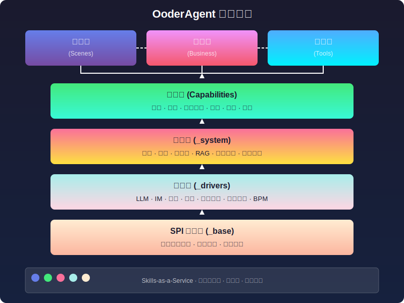
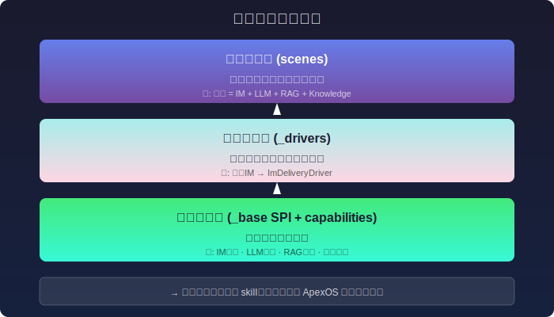

# OoderAgent: Zero-Deployment Enterprise AI Agent Capability Ecosystem

<p align="center">
  
</p>

<p align="center">
  <strong>MIT Open Source</strong> · <strong>137+ Standardized Skills</strong> · <strong>Zero-Deployment Ready</strong> · <strong>P2P Capability Sharing</strong>
</p>

---

## Abstract

OoderAgent is a revolutionary enterprise-level AI Agent platform based on the **Skills Architecture** design philosophy, enabling enterprises to build their own private AI capability libraries with **zero deployment and zero installation**. The platform includes **137+ standardized skills** covering LLM integration, business processes, knowledge management, communication and collaboration, and more - ready to use out of the box, supporting P2P capability sharing, truly democratizing AI capabilities.

---

## Table of Contents

- [I. Core Architecture](#i-core-architecture)
- [II. Capability Library Overview](#ii-capability-library-overview137-skills-coverage)
- [III. Skills Classification Deep Dive](#iii-skills-classification-deep-dive)
- [IV. User Scenarios](#iv-user-scenarioshow-skills-combine)
- [V. Scene Classification Details](#v-scene-classification-detailsthree-types-and-file-structure)
- [VI. Technical Principles](#vi-technical-principles-deep-analysis)
- [VII. Custom Skill Development](#vii-custom-skill-development)
- [VIII. Enterprise Private Deployment](#viii-building-enterprise-private-capability-library)
- [IX. Quick Start](#ix-quick-start)
- [X. Summary and Outlook](#x-summary-and-outlook)

---

## I. Core Architecture

### 1.1 Skills Architecture Design Philosophy

OoderAgent adopts a **Skills-as-a-Service** architecture, abstracting complex AI capabilities into pluggable skill modules:



### 1.2 Core Features

| Feature | Description | Advantage |
|---------|-------------|-----------|
| **Zero Deployment** | ApexOS ready out of the box | No installation, start and use |
| **MIT Open Source** | Completely open source and free | Enterprise self-control |
| **137+ Skills** | Full business scenario coverage | Ready to use |
| **SPI Architecture** | Standardized interfaces | Easy to extend |
| **P2P Sharing** | Peer-to-peer skill sharing | Ecosystem building |

### 1.3 Project Directory Structure

```
E:\github\ooder-skills\
├── skills/                        # ★ Core Skills Library (137+ modules)
│   ├── _base/                     # SPI Base Layer (4 modules)
│   ├── _drivers/                  # Driver Layer (37 - LLM/IM/Media/Payment/BPM/VFS/Org)
│   ├── _system/                   # System Layer (32 modules)
│   ├── _business/                 # Business Layer (11 modules)
│   ├── capabilities/              # Capability Layer (24 - Communication/Monitoring/Infrastructure/Scheduling/Search/Auth/LLM)
│   ├── scenes/                    # Scene Layer (16 business scenarios)
│   ├── tools/                     # Tool Layer (10 modules)
│   ├── config/                    # Global Configuration
│   ├── diagram_*.svg              # Architecture Diagrams (9+ SVGs)
│   └── OODER_AGENT_UPGRADE_BLOG.md  # Complete Blog
│
├── app/                           # Application Modules
│   ├── skill-common/              # Common Dependencies
│   ├── skill-hotplug-starter/     # Hot-plug Starter
│   └── skill-org-base/            # Organization Base
│
├── templates/                     # Skill Templates
├── skill-index/                   # Skill Index Definition
├── scripts/                       # Build/Pack Scripts
├── docs/                          # Design Docs & Specs
├── archive/                       # Historical Archive
├── .github/workflows/             # CI/CD
├── pom.xml                        # Maven Parent POM
├── LICENSE                        # MIT License
└── README.md                      # This file
```

---

## II. Capability Library Overview: 137 Skills Coverage

### 2.1 Skills Classification Statistics

OoderAgent capability library contains **137 standardized skill modules**, distributed across 7 major layers:

| Layer | Count | Percentage | Core Capabilities |
|-------|-------|------------|-------------------|
| **SPI Base Layer** (`_base`) | 4 | 2.9% | Unified interfaces, service discovery |
| **Driver Layer** (`_drivers`) | 37 | 27.0% | External system integration |
| **System Layer** (`_system`) | 32 | 23.4% | Core system services |
| **Capability Layer** (`capabilities`) | 24 | 17.5% | Reusable base capabilities |
| **Scene Layer** (`scenes`) | 16 | 11.7% | Business scenario encapsulation |
| **Business Layer** (`_business`) | 11 | 8.0% | Business logic processing |
| **Tool Layer** (`tools`) | 10 | 7.3% | Auxiliary tools |


### 2.2 Driver Layer: Full Platform Integration Capabilities

#### LLM Driver Matrix (8 modules)

| Driver | Provider | Deployment |
|--------|----------|------------|
| DeepSeek | DeepSeek | Cloud API |
| OpenAI | OpenAI | Cloud API |
| Qianwen | Alibaba Cloud | Cloud API |
| Wenxin | Baidu | Cloud API |
| Volcengine | ByteDance | Cloud API |
| Ollama | Open Source Community | Local Deployment |
| LLM Base | Abstraction Layer | - |
| LLM Monitor | Monitoring Service | - |

#### Other Driver Categories

| Category | Count | Description |
|----------|-------|-------------|
| **IM Communication** | 4 | DingTalk, Feishu, WeCom, WeChat |
| **Media Publishing** | 5 | Toutiao, WeChat MP, Weibo, Xiaohongshu, Zhihu |
| **Payment** | 3 | Alipay, WeChat Pay, UnionPay |
| **Organization** | 6 | DingTalk, Feishu, WeCom, LDAP, etc. |
| **Virtual File System** | 7 | Local, MinIO, OSS, S3, Database, etc. |
| **BPM** | 3 | BPM Server / Designer / Skill |

---

## III. Skills Classification Deep Dive

### 3.1 Key Skills Description

| Skill Category | Core Modules | Description |
|----------------|--------------|-------------|
| **LLM Driver Matrix** (8) | DeepSeek, OpenAI, Qianwen, Wenxin, Volcengine, Ollama, LLM Base/Monitor | Unified `LlmProvider` interface, zero-cost switching |
| **IM Drivers** (4) | DingTalk, Feishu, WeCom, WeChat | Unified `ImDeliveryDriver` interface |
| **Media Publishing** (5) | Toutiao, WeChat MP, Weibo, Xiaohongshu, Zhihu | Unified `MediaPublishProvider` interface |
| **Payment Drivers** (3) | Alipay, WeChat Pay, UnionPay | Unified `PaymentProvider` interface |
| **System Core Services** (6) | skill-auth, skill-config, skill-workflow, skill-rag, skill-knowledge, skill-messaging | Platform infrastructure |

### 3.2 Scene Layer Detailed List (16 Business Scenarios)

| Scene Name | Module ID | Description |
|------------|-----------|-------------|
| Daily Report Generation | daily-report | Auto-summarize work content, AI-generated reports |
| Meeting Minutes | meeting-minutes | Speech recognition + AI summary generation |
| Approval Form | approval-form | Workflow-driven approval process |
| Knowledge Q&A | knowledge-qa | RAG-enhanced enterprise knowledge Q&A |
| Onboarding Assistant | onboarding-assistant | New employee guidance, policy Q&A |
| Collaboration Office | collaboration | Real-time communication + document collaboration |
| Document Assistant | document-assistant | Document parsing + intelligent Q&A |
| Project Knowledge | project-knowledge | Project-dimension knowledge aggregation |
| Agent Recommendation | agent-recommendation | Intelligent Agent recommendation |
| Real Estate Form | real-estate-form | Industry-specific form scenario |
| Recording Q&A | recording-qa | Speech-to-text then RAG Q&A |
| Recruitment Management | recruitment-management | Recruitment process automation |
| Business Processing | business | Rule engine + workflow |
| Knowledge Management | knowledge-management | Document management + vector storage |
| Knowledge Sharing | knowledge-share | Permission control + collaborative editing |
| Platform Binding | platform-bind | Multi-platform account binding |

---

## IV. User Scenarios: How Skills Combine

OoderAgent's core philosophy is **"Declarative Assembly"**: enterprises only need to select target scenarios, and underlying skill dependencies are automatically resolved and injected by ApexOS.


### 4.1 Six Typical Scenario Derivations

| Scenario | User Need | Skill Combination | Effect |
|----------|-----------|-------------------|--------|
| 🎯 **Intelligent Customer Service** | Auto-answer customer questions | IM(DingTalk) + LLM(DeepSeek) + RAG + Knowledge + Messaging | Multi-channel auto-response |
| 📋 **Daily Report Generation** | Auto-summarize work content | LLM(Qianwen) + daily-report + template + notification | Scheduled AI summary delivery |
| ✅ **Approval Automation** | Mobile process approval | BPM + Org + IM notification + approval-form | Multi-level approval status tracking |
| 📰 **Multi-platform Publishing** | One article, multiple platforms | LLM + Media×5(Toutiao/WeChat MP/Weibo/Xiaohongshu/Zhihu) | One-click 5-platform publishing |
| 🔍 **Knowledge Q&A** | Enterprise document intelligent Q&A | RAG + Vector Search + LLM + knowledge-qa | Semantic search + source tracing |
| 👋 **Onboarding Assistant** | New employee guidance | Knowledge + LLM + onboarding-assistant | Guided tasks + FAQ |

### 4.2 Skill Combination Three-Layer Architecture



---

## V. Scene Classification Details: Three Types and File Structure


### 5.1 Three Types Comparison

| Dimension | Scene Type (Scenes) | Independent Type (Drivers/Caps) | Internal Type (Base/System) |
|-----------|---------------------|--------------------------------|----------------------------|
| **Path** | `skills/scenes/` | `skills/_drivers/`, `capabilities/` | `skills/_base/`, `_system/`, `_business/` |
| **Count** | 16 | 61 | 47 |
| **Standalone Run** | ✅ | ✅ | ❌ |
| **Expose REST API** | Optional | ✅ | ❌ |
| **Consumed by Others** | No | Optional | ✅ |
| **Loading Method** | User triggered | Independent port startup | ClassLoader loading |

### 5.2 Typical File Structure Examples

**Scene Type** (`scenes/daily-report/`):
```
├── skill.yaml              # Metadata + dependency declaration (version: "3.0.1")
├── README.md               # Usage documentation
├── src/main/java/          # Java source code
├── pom.xml                 # Maven build config
└── resources/              # Config files, templates
```

**Independent Type** (`_drivers/im/skill-im-dingding/`):
```
├── skill.yaml              # Complete spec definition
├── README.md               # API docs + usage examples
├── src/main/java/
│   ├── controller/          # REST API endpoints
│   └── service/             # Business logic implementation
├── pom.xml                 # Contains parent dependency
└── resources/
    └── application.yml     # Port, database config
```

**Internal Type** (`_base/ooder-spi-core/`):
```
├── skill.yaml              # SPI interface declaration
├── README.md               # Interface design documentation
├── src/main/java/
│   └── net.ooder.spi/       # Pure interface definitions
├── pom.xml                 # Interface-only dependencies
└── META-INF/services/      # SPI registration files
```

### 5.3 Dependency Chain

```
scenes (Scene Type) → _business → _system → _base (SPI Core Interface)
                                              ├── _drivers (Independent Type) → _base
                                              └── capabilities (Independent Type) → _base
```

---

## VI. Technical Principles Deep Analysis

### 6.1 SPI Service Discovery Mechanism

OoderAgent adopts JDK standard SPI (Service Provider Interface) mechanism for modularization:


**Core Interfaces**:
- `ImDeliveryDriver` — Unified IM message delivery interface
- `RagEnhanceDriver` — RAG enhanced retrieval interface
- `WorkflowDriver` — Workflow driver interface
- `LlmProvider` — LLM model invocation interface
- `UnifiedMessagingService` — Unified messaging service interface

### 6.2 Dependency Auto-Processing

```yaml
# skill.yaml dependency declaration example
dependencies:
  - id: ooder-spi-core
    version: ">=3.0.1"
    required: true
    description: "SPI core interface"
  - id: skill-config
    version: ">=3.0.0"
    required: false
    description: "Config service (optional)"
```

**Auto-processing Mechanism**: Dependency resolution → Version matching (SemVer) → Cycle detection → Lazy loading

### 6.3 Zero-Deployment Technical Implementation


**Deployment Flow**: Drop skill package → `java -jar apexos.jar` → Auto-scan and load → API ready

No Docker, Kubernetes, configuration files, or manual installation required.

---

## VII. Custom Skill Development


### 7.1 Four-Step Development

1. **Create Project**: `mvn archetype:generate -DarchetypeGroupId=net.ooder`
2. **Implement Interface**: `implements SkillProvider` → Write business logic
3. **Configure skill.yaml**: Declare metadata, version `"3.0.1"`, dependencies, endpoints
4. **Package and Deploy**: `mvn package` → Copy to `skills/` directory → Auto-load

### 7.2 Skill Upload and P2P Sharing


- Enterprises can choose to publish skills to P2P network
- Other enterprises can search, subscribe, and use shared skills
- Private skills remain isolated within enterprise intranet

---

## VIII. Building Enterprise Private Capability Library


### 8.1 Typical Application Scenarios

| Scenario | Required Skills | Deployment Mode |
|----------|-----------------|-----------------|
| **Intelligent Customer Service** | IM driver + LLM + Knowledge base | Intranet deployment |
| **Daily Report Generation** | Scene skill + LLM | Intranet deployment |
| **Process Approval** | BPM + Notification + Organization | Intranet deployment |
| **Knowledge Q&A** | RAG + Search + LLM | Intranet deployment |
| **Multi-platform Publishing** | Media driver + Content generation | Hybrid deployment |

Data Security: Complete enterprise intranet isolation, data never leaves the domain.

---

## IX. Quick Start

### 9.1 One-Click Startup

```bash
# Clone repository
git clone https://github.com/ooderCN/ooder-skills.git
cd ooder-skills

# Start ApexOS (zero config, ready to use)
java -jar apexos.jar

# Access console
open http://localhost:8080
```

### 9.2 Add Skills

```bash
# Method 1: Copy skill package to directory
cp my-skill.jar skills/

# Method 2: Install from skill marketplace
apexos skill install skill-llm-deepseek

# Method 3: Subscribe from P2P network
apexos skill subscribe p2p://enterprise-a/skill-customer-service
```

### 9.3 Develop Custom Skills

```java
@Service
public class MyEnterpriseSkill implements SkillProvider {
    
    @Override
    public Capability getCapability() {
        return Capability.builder()
            .id("my-enterprise-skill")
            .name("Enterprise Exclusive Skill")
            .version("1.0.0")
            .build();
    }
    
    @Override
    public Response execute(Request request) {
        return Response.success(result);
    }
}
```

### 9.4 Environment Requirements

| Component | Version |
|-----------|---------|
| JDK | 21+ |
| Spring Boot | 3.4.x |
| Maven | 3.8+ |
| OS | Windows / Linux / macOS |

---

## X. Summary and Outlook

### 10.1 OoderAgent Core Value Comparison

| Dimension | Traditional Solution | OoderAgent |
|-----------|---------------------|------------|
| **Deployment** | Weeks of configuration | Seconds to start |
| **Integration** | One-by-one integration | Plug-and-play skills |
| **Extension** | Custom development | Self-develop/P2P share |
| **Cost** | High licensing fees | MIT open source free |
| **Control** | Third-party dependent | Fully self-controlled |

### 10.2 Future Roadmap

1. **Skill Marketplace 2.0** — More complete P2P skill trading ecosystem
2. **Visual Orchestration** — Drag-and-drop Agent workflow design
3. **Multi-modal Support** — Image, audio, video full-modal skills
4. **Edge Computing** — Support edge device deployment of lightweight skills
5. **AI Native IDE** — AI-assisted skill development tools

---

## Appendix

### Related Links

| Link | URL |
|------|-----|
| **GitHub** | https://github.com/ooderCN/ooder-skills |
| **Gitee** | https://gitee.com/ooderCN/ooder-skills |
| **Documentation** | https://docs.ooder.net |
| **Skill Marketplace** | https://market.ooder.net |

### Tech Stack

- **Java 21** — Runtime environment
- **Spring Boot 3.4** — Application framework
- **SPI Plugin Mechanism** — Modularization core
- **Maven** — Build management
- **P2P Network Protocol** — Capability sharing
- **MIT License** — Open source license

### Version Information

- **Current Version**: 3.0.1
- **Total Skills**: 137+
- **Config Coverage**: 100% (all skill.yaml in place)
- **Version Consistency**: 100% (all at 3.0.1)

---

<p align="center">
  <strong>Copyright © 2026 Ooder Team</strong> · 
  <a href="./LICENSE">MIT License</a> — Completely free, enterprise self-controlled
</p>
