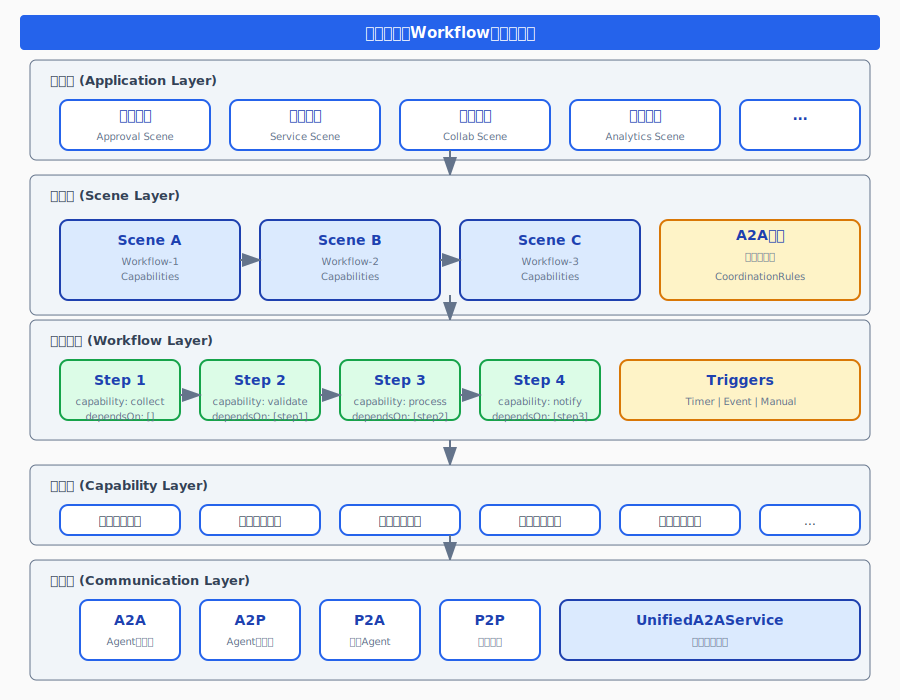

# 场景驱动与Workflow关系图



## 一、核心概念定义

### 1.1 场景(Scene)

**定义**: 场景是业务上下文的载体，封装了参与者、能力、工作流和知识库的完整业务单元。

**核心属性**:
- `sceneId`: 场景唯一标识
- `sceneGroupId`: 所属场景组
- `capabilities`: 绑定的能力列表
- `participants`: 参与者列表
- `workflow`: 关联的工作流定义

### 1.2 场景组(SceneGroup)

**定义**: 场景组是多个相关场景的集合，提供跨场景的协作和通讯机制。

**核心属性**:
- `sceneGroupId`: 场景组唯一标识
- `scenes`: 包含的场景列表
- `coordinationRules`: 场景间协调规则
- `knowledgeBindings`: 共享知识库绑定

### 1.3 工作流(Workflow)

**定义**: 工作流是场景内能力执行的编排定义，描述能力之间的依赖关系和执行顺序。

**核心属性**:
- `workflowId`: 工作流唯一标识
- `steps`: 工作流步骤列表
- `triggers`: 触发器配置
- `phases`: 执行阶段定义

---

## 二、能力依赖关系与Workflow定义

### 2.1 能力定义结构

```
CapabilityDefDTO
├── capId: 能力唯一标识
├── name: 能力名称
├── description: 能力描述
├── category: 能力分类
├── parameters: 参数定义列表
├── returns: 返回值定义
└── permissions: 权限要求
```

### 2.2 Workflow步骤定义

```
WorkflowStepDefDTO
├── stepId: 步骤唯一标识
├── name: 步骤名称
├── capability: 绑定的能力ID
├── executor: 执行者(Actor/Agent)
├── type: 步骤类型
├── input: 输入参数映射
├── output: 输出变量名
├── dependsOn: 依赖步骤列表 ← 能力依赖关系
├── parallel: 是否并行执行
├── delay: 延迟执行时间
└── timeout: 超时时间
```

### 2.3 能力依赖关系图

```
┌─────────────────────────────────────────────────────────────────┐
│                    WorkflowDefinitionDTO                         │
│  ┌───────────────────────────────────────────────────────────┐  │
│  │                    triggers: 触发器列表                     │  │
│  │  ┌─────────┐  ┌─────────┐  ┌─────────┐                   │  │
│  │  │Timer    │  │Event    │  │Manual   │                   │  │
│  │  └─────────┘  └─────────┘  └─────────┘                   │  │
│  └───────────────────────────────────────────────────────────┘  │
│                                                                  │
│  ┌───────────────────────────────────────────────────────────┐  │
│  │                    steps: 步骤列表                         │  │
│  │                                                            │  │
│  │    ┌──────────┐      dependsOn       ┌──────────┐         │  │
│  │    │ Step 1   │ ───────────────────→ │ Step 2   │         │  │
│  │    │(能力A)   │                      │(能力B)   │         │  │
│  │    └──────────┘                      └────┬─────┘         │  │
│  │         │                                 │               │  │
│  │         │         ┌──────────┐            │               │  │
│  │         └───────→ │ Step 3   │ ←──────────┘               │  │
│  │                   │(能力C)   │                            │  │
│  │                   └────┬─────┘                            │  │
│  │                        │                                  │  │
│  │                        ▼                                  │  │
│  │                   ┌──────────┐                            │  │
│  │                   │ Step 4   │                            │  │
│  │                   │(能力D)   │                            │  │
│  │                   └──────────┘                            │  │
│  └───────────────────────────────────────────────────────────┘  │
└─────────────────────────────────────────────────────────────────┘
```

### 2.4 能力协作通过Workflow定义的方式

**方式一: 顺序执行**
```yaml
steps:
  - stepId: step1
    capability: data-collection
    dependsOn: []
    
  - stepId: step2
    capability: data-validation
    dependsOn: [step1]
    
  - stepId: step3
    capability: data-storage
    dependsOn: [step2]
```

**方式二: 并行执行**
```yaml
steps:
  - stepId: step1
    capability: email-notification
    parallel: true
    
  - stepId: step2
    capability: sms-notification
    parallel: true
    
  - stepId: step3
    capability: log-record
    dependsOn: [step1, step2]
```

**方式三: 条件分支**
```yaml
steps:
  - stepId: check-amount
    capability: amount-validator
    
  - stepId: manager-approval
    capability: approval-service
    condition: "amount > 10000"
    dependsOn: [check-amount]
    
  - stepId: auto-approve
    capability: auto-approver
    condition: "amount <= 10000"
    dependsOn: [check-amount]
```

---

## 三、场景内部通讯与Workflow调用关系

### 3.1 通讯协议分类

| 协议 | 全称 | 说明 | 使用场景 |
|------|------|------|----------|
| **A2A** | Agent-to-Agent | Agent之间的通讯协议 | 多Agent协作、任务委托 |
| **A2P** | Agent-to-Process | Agent到流程的调用协议 | Agent触发/执行工作流 |
| **P2A** | Person-to-Agent | 人到Agent的交互协议 | 用户与Agent对话、任务下发 |
| **P2P** | Person-to-Person | 人与人的协作协议 | 团队协作、会签审批 |

### 3.2 A2A与Workflow关系

```
┌─────────────────────────────────────────────────────────────────┐
│                        场景组(SceneGroup)                        │
│                                                                  │
│  ┌─────────────────┐         A2A通讯         ┌─────────────────┐│
│  │    Scene A      │◄───────────────────────►│    Scene B      ││
│  │                 │                         │                 ││
│  │  ┌───────────┐  │                         │  ┌───────────┐  ││
│  │  │ Workflow  │  │                         │  │ Workflow  │  ││
│  │  │ Instance  │  │                         │  │ Instance  │  ││
│  │  └─────┬─────┘  │                         │  └─────┬─────┘  ││
│  │        │        │                         │        │        ││
│  │        ▼        │                         │        ▼        ││
│  │  ┌───────────┐  │                         │  ┌───────────┐  ││
│  │  │ Agent A   │  │                         │  │ Agent B   │  ││
│  │  │(执行能力) │  │                         │  │(执行能力) │  ││
│  │  └───────────┘  │                         │  └───────────┘  ││
│  └─────────────────┘                         └─────────────────┘│
│                                                                  │
│  ┌─────────────────────────────────────────────────────────────┐│
│  │              CoordinationRuleDTO (协调规则)                  ││
│  │  - sourceScene: Scene A                                     ││
│  │  - targetScene: Scene B                                     ││
│  │  - trigger: workflow_complete                               ││
│  │  - action: start_workflow                                   ││
│  └─────────────────────────────────────────────────────────────┘│
└─────────────────────────────────────────────────────────────────┘
```

### 3.3 A2P调用与Workflow关系

```
┌─────────────────────────────────────────────────────────────────┐
│                     Agent-to-Process 调用链                      │
│                                                                  │
│  ┌─────────────┐      A2P调用       ┌───────────────────────┐  │
│  │   Agent     │ ─────────────────→ │   WorkflowService     │  │
│  │             │                    │                       │  │
│  │ - 分析任务  │                    │ - start()             │  │
│  │ - 决策执行  │                    │ - cancel()            │  │
│  │ - 调用流程  │                    │ - pause()             │  │
│  │ - 监控状态  │                    │ - resume()            │  │
│  └─────────────┘                    └───────────┬───────────┘  │
│                                                 │               │
│                                                 ▼               │
│  ┌─────────────────────────────────────────────────────────────┐│
│  │              SceneWorkflowInstanceDTO                        ││
│  │  - workflowId: 工作流实例ID                                  ││
│  │  - sceneGroupId: 场景组ID                                    ││
│  │  - status: 运行状态                                          ││
│  │  - currentStep: 当前步骤                                     ││
│  │  - totalSteps: 总步骤数                                      ││
│  │  - context: 执行上下文                                       ││
│  └─────────────────────────────────────────────────────────────┘│
└─────────────────────────────────────────────────────────────────┘
```

### 3.4 P2A与Workflow关系

```
┌─────────────────────────────────────────────────────────────────┐
│                     Person-to-Agent 交互链                       │
│                                                                  │
│  ┌─────────────┐      P2A交互       ┌───────────────────────┐  │
│  │    User     │ ─────────────────→ │       Agent           │  │
│  │             │                    │                       │  │
│  │ - 发起请求  │                    │ - 接收请求            │  │
│  │ - 提供数据  │                    │ - 解析意图            │  │
│  │ - 确认结果  │                    │ - 调用Workflow        │  │
│  └─────────────┘                    │ - 返回结果            │  │
│       ▲                             └───────────┬───────────┘  │
│       │                                         │               │
│       │ 反馈                                    │ A2P调用       │
│       │                                         ▼               │
│  ┌────┴────────┐                    ┌───────────────────────┐  │
│  │   结果展示  │ ←───────────────── │   WorkflowInstance    │  │
│  └─────────────┘                    └───────────────────────┘  │
└─────────────────────────────────────────────────────────────────┘
```

---

## 四、场景驱动流程自动构建

### 4.1 自动构建流程

```
用户描述业务需求
       │
       ▼
┌─────────────────┐
│   NLP解析引擎   │
│ - 意图识别      │
│ - 实体提取      │
│ - 关系推导      │
└────────┬────────┘
         │
         ▼
┌─────────────────┐
│   能力匹配引擎  │
│ - 能力搜索      │
│ - 相关度评分    │
│ - 能力推荐      │
└────────┬────────┘
         │
         ▼
┌─────────────────┐
│   依赖分析引擎  │
│ - 能力依赖检测  │
│ - 执行顺序推导  │
│ - 并行度分析    │
└────────┬────────┘
         │
         ▼
┌─────────────────┐
│  Workflow生成器 │
│ - 步骤定义      │
│ - 依赖关系设置  │
│ - 触发器配置    │
└────────┬────────┘
         │
         ▼
┌─────────────────┐
│   场景模板生成  │
│ - 能力绑定      │
│ - 角色定义      │
│ - Workflow关联  │
└─────────────────┘
```

### 4.2 能力依赖关系获取

**方式一: 显式定义**
```java
// 在CapabilityDefDTO中定义依赖
CapabilityDefDTO capability = new CapabilityDefDTO();
capability.setCapId("email-notification");
capability.setDependencies(List.of("smtp-config", "template-engine"));
```

**方式二: 隐式推导**
```java
// 通过参数分析推导依赖
public List<String> deriveDependencies(CapabilityDefDTO capability) {
    List<String> dependencies = new ArrayList<>();
    
    // 分析输入参数
    for (Map<String, Object> param : capability.getParameters()) {
        String source = (String) param.get("source");
        if (source != null && source.startsWith("capability://")) {
            dependencies.add(source.substring("capability://".length()));
        }
    }
    
    return dependencies;
}
```

**方式三: LLM推理**
```java
// 使用LLM分析能力描述，推导依赖关系
public List<String> inferDependencies(String capabilityDesc, List<CapabilityDefDTO> allCapabilities) {
    String prompt = buildDependencyPrompt(capabilityDesc, allCapabilities);
    LLMResponse response = llmService.chat(prompt);
    return parseDependencies(response.getContent());
}
```

---

## 五、完整关系图

### 5.1 场景驱动架构总览

```
┌─────────────────────────────────────────────────────────────────────────┐
│                           应用层 (Application)                           │
│  ┌───────────────────────────────────────────────────────────────────┐  │
│  │                     业务场景 (Business Scenes)                     │  │
│  │  ┌─────────┐  ┌─────────┐  ┌─────────┐  ┌─────────┐              │  │
│  │  │审批场景  │  │客服场景  │  │协作场景  │  │分析场景  │              │  │
│  │  └─────────┘  └─────────┘  └─────────┘  └─────────┘              │  │
│  └───────────────────────────────────────────────────────────────────┘  │
└─────────────────────────────────────────────────────────────────────────┘
                                    │
                                    ▼
┌─────────────────────────────────────────────────────────────────────────┐
│                           场景层 (Scene Layer)                           │
│  ┌───────────────────────────────────────────────────────────────────┐  │
│  │                     SceneGroup (场景组)                            │  │
│  │  ┌─────────────────────────────────────────────────────────────┐  │  │
│  │  │  Scene A    ←──A2A──→    Scene B    ←──A2A──→    Scene C   │  │  │
│  │  │  ┌─────┐                 ┌─────┐                 ┌─────┐   │  │  │
│  │  │  │WF-1 │                 │WF-2 │                 │WF-3 │   │  │  │
│  │  │  └──┬──┘                 └──┬──┘                 └──┬──┘   │  │  │
│  │  │     │                       │                       │      │  │  │
│  │  │  ┌──▼──┐                 ┌──▼──┐                 ┌──▼──┐   │  │  │
│  │  │  │Caps │                 │Caps │                 │Caps │   │  │  │
│  │  │  └─────┘                 └─────┘                 └─────┘   │  │  │
│  │  └─────────────────────────────────────────────────────────────┘  │  │
│  │                                                                   │  │
│  │  CoordinationRules: 场景间协调规则                                │  │
│  │  - 事件触发规则                                                   │  │
│  │  - 数据传递规则                                                   │  │
│  │  - 状态同步规则                                                   │  │
│  └───────────────────────────────────────────────────────────────────┘  │
└─────────────────────────────────────────────────────────────────────────┘
                                    │
                                    ▼
┌─────────────────────────────────────────────────────────────────────────┐
│                         工作流层 (Workflow Layer)                        │
│  ┌───────────────────────────────────────────────────────────────────┐  │
│  │                   WorkflowDefinition                               │  │
│  │  ┌─────────────────────────────────────────────────────────────┐  │  │
│  │  │  Triggers: 触发器                                            │  │  │
│  │  │  - Timer: 定时触发                                           │  │  │
│  │  │  - Event: 事件触发                                           │  │  │
│  │  │  - Manual: 手动触发                                          │  │  │
│  │  └─────────────────────────────────────────────────────────────┘  │  │
│  │  ┌─────────────────────────────────────────────────────────────┐  │  │
│  │  │  Steps: 步骤编排                                             │  │  │
│  │  │                                                              │  │  │
│  │  │    Step1 ──dependsOn──→ Step2 ──dependsOn──→ Step3          │  │  │
│  │  │      │                       │                               │  │  │
│  │  │      └─────→ Step4 ←─────────┘ (并行合并)                    │  │  │
│  │  │                                                              │  │  │
│  │  │  每个Step绑定:                                               │  │  │
│  │  │  - capability: 执行的能力                                    │  │  │
│  │  │  - executor: 执行者(Agent)                                   │  │  │
│  │  │  - input/output: 数据映射                                    │  │  │
│  │  └─────────────────────────────────────────────────────────────┘  │  │
│  └───────────────────────────────────────────────────────────────────┘  │
└─────────────────────────────────────────────────────────────────────────┘
                                    │
                                    ▼
┌─────────────────────────────────────────────────────────────────────────┐
│                          能力层 (Capability Layer)                       │
│  ┌───────────────────────────────────────────────────────────────────┐  │
│  │                    Capability Registry                             │  │
│  │  ┌─────────┐  ┌─────────┐  ┌─────────┐  ┌─────────┐              │  │
│  │  │数据采集  │  │数据处理  │  │消息通知  │  │流程审批  │              │  │
│  │  │能力     │  │能力     │  │能力     │  │能力     │              │  │
│  │  └─────────┘  └─────────┘  └─────────┘  └─────────┘              │  │
│  │                                                                   │  │
│  │  能力依赖关系:                                                    │  │
│  │  - 显式定义: dependencies字段                                     │  │
│  │  - 隐式推导: 参数source分析                                       │  │
│  │  - LLM推理: 语义分析推导                                          │  │
│  └───────────────────────────────────────────────────────────────────┘  │
└─────────────────────────────────────────────────────────────────────────┘
                                    │
                                    ▼
┌─────────────────────────────────────────────────────────────────────────┐
│                          通讯层 (Communication Layer)                    │
│  ┌───────────────────────────────────────────────────────────────────┐  │
│  │  ┌─────────┐  ┌─────────┐  ┌─────────┐  ┌─────────┐              │  │
│  │  │  A2A    │  │  A2P    │  │  P2A    │  │  P2P    │              │  │
│  │  │Agent间  │  │Agent到  │  │人到     │  │人间     │              │  │
│  │  │通讯     │  │流程     │  │Agent    │  │协作     │              │  │
│  │  └─────────┘  └─────────┘  └─────────┘  └─────────┘              │  │
│  │       │            │            │            │                   │  │
│  │       └────────────┴────────────┴────────────┘                   │  │
│  │                          │                                        │  │
│  │                          ▼                                        │  │
│  │  ┌─────────────────────────────────────────────────────────────┐  │  │
│  │  │              UnifiedA2AService (统一通讯服务)                │  │  │
│  │  │  - sendMessage: 发送消息                                     │  │  │
│  │  │  - broadcastMessage: 广播消息                                │  │  │
│  │  │  - subscribeToMessages: 订阅消息                             │  │  │
│  │  │  - getSessionInfo: 获取会话信息                              │  │  │
│  │  └─────────────────────────────────────────────────────────────┘  │  │
│  └───────────────────────────────────────────────────────────────────┘  │
└─────────────────────────────────────────────────────────────────────────┘
```

### 5.2 调用关系时序图

```
User                 Agent              WorkflowService           Capability
  │                    │                      │                        │
  │  P2A: 发起请求     │                      │                        │
  │───────────────────→│                      │                        │
  │                    │                      │                        │
  │                    │  A2P: 启动Workflow   │                        │
  │                    │─────────────────────→│                        │
  │                    │                      │                        │
  │                    │                      │  执行Step1 (能力A)     │
  │                    │                      │───────────────────────→│
  │                    │                      │                        │
  │                    │                      │←───────────────────────│
  │                    │                      │      执行结果          │
  │                    │                      │                        │
  │                    │                      │  执行Step2 (能力B)     │
  │                    │                      │───────────────────────→│
  │                    │                      │                        │
  │                    │                      │←───────────────────────│
  │                    │                      │      执行结果          │
  │                    │                      │                        │
  │                    │  A2P: Workflow完成   │                        │
  │                    │←─────────────────────│                        │
  │                    │                      │                        │
  │  P2A: 返回结果     │                      │                        │
  │←───────────────────│                      │                        │
  │                    │                      │                        │
```

---

## 六、关键数据结构

### 6.1 SceneTemplateDTO

```java
public class SceneTemplateDTO {
    private String templateId;
    private String name;
    private String description;
    private String version;
    private String category;
    private String type;
    private String status;
    private String participantMode;
    private boolean active;
    private long createTime;
    private long updateTime;
    private List<CapabilityDefDTO> capabilities;  // 能力定义列表
    private List<RoleDefinitionDTO> roles;        // 角色定义列表
    private Map<String, Object> menus;            // 菜单配置
    private WorkflowDefinitionDTO workflow;       // 工作流定义
    private Map<String, Object> metadata;         // 元数据
}
```

### 6.2 WorkflowDefinitionDTO

```java
public class WorkflowDefinitionDTO {
    private List<TriggerDefinitionDTO> triggers;  // 触发器列表
    private List<StepDefinitionDTO> steps;        // 步骤列表
}
```

### 6.3 WorkflowStepDefDTO

```java
public class WorkflowStepDefDTO {
    private String stepId;
    private String name;
    private String capability;        // 绑定的能力ID
    private String executor;          // 执行者
    private String type;
    private Map<String, Object> input;
    private String output;
    private List<String> dependsOn;   // 依赖步骤列表
    private boolean parallel;         // 是否并行
    private long delay;
    private long timeout;
}
```

### 6.4 CoordinationRuleDTO

```java
public class CoordinationRuleDTO {
    private String ruleId;
    private String name;
    private String sourceScene;       // 源场景
    private String targetScene;       // 目标场景
    private String trigger;           // 触发条件
    private String condition;         // 执行条件
    private String action;            // 执行动作
    private int priority;
    private boolean enabled;
    private Map<String, Object> config;
}
```

---

## 七、总结

### 7.1 核心关系

1. **场景(Scene) → 工作流(Workflow)**: 一对多关系，一个场景可以包含多个工作流定义
2. **工作流(Workflow) → 步骤(Step)**: 一对多关系，工作流由多个步骤组成
3. **步骤(Step) → 能力(Capability)**: 一对一关系，每个步骤绑定一个能力
4. **步骤(Step) → 步骤(Step)**: 多对多关系，通过dependsOn定义依赖

### 7.2 通讯协议关系

| 协议 | 角色 | Workflow关系 |
|------|------|--------------|
| A2A | Agent ↔ Agent | 跨场景工作流协调 |
| A2P | Agent → Workflow | Agent触发/管理工作流 |
| P2A | User → Agent | 用户通过Agent间接操作工作流 |
| P2P | User ↔ User | 工作流中的人工协作节点 |

### 7.3 自动构建关键点

1. **能力依赖获取**: 显式定义 + 隐式推导 + LLM推理
2. **Workflow生成**: 基于能力依赖关系自动编排步骤
3. **场景模板生成**: 能力绑定 + 角色定义 + Workflow关联

---

**文档版本**: v1.0  
**创建日期**: 2026-04-08  
**文档路径**: E:\github\ooder-skills\docs\bpm-designer\scene-workflow-relationship.md
