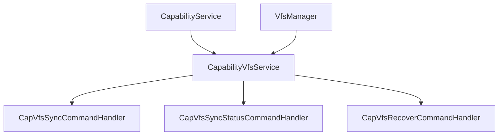

# Capability-VFS 集成协作需求文档

**文档版本**: v1.0  
**创建日期**: 2026-04-04  
**协作团队**: skill-protocol、skill-capability、skill-vfs  
**优先级**: 中等

---

## 一、背景说明

在完成 AI Bridge Protocol 移植过程中，我们发现需要实现 Capability 与 VFS 的集成功能，以支持以下命令：

1. **VFS 同步** - `cap.vfs.sync`
2. **VFS 同步状态** - `cap.vfs.sync.status`
3. **VFS 数据恢复** - `cap.vfs.recover`

---

## 二、当前状态

### 2.1 已有模块

#### CapabilityService

**文件位置**: `E:\github\ooder-skills\skills\_system\skill-capability\src\main\java\net\ooder\skill\capability\service\CapabilityService.java`

**功能**:
- Capability 的声明、更新、查询、移除
- Capability 类型和分类管理

#### VfsManager

**文件位置**: `E:\github\ooder-skills\skills\_drivers\vfs\skill-vfs-base\src\main\java\net\ooder\skill\vfs\base\VfsManager.java`

**功能**:
- 文件和文件夹的创建、删除、查询
- 文件的上传和下载
- 支持多种实现：local、s3、oss、minio、database

**接口定义**:
```java
public interface VfsManager {
    FileInfo getFileInfoByID(String fileId);
    FileInfo createFile(String folderId, String name);
    boolean deleteFile(String fileId);
    List<FileInfo> listFiles(String folderId);
    Folder getFolderByID(String folderId);
    Folder createFolder(String parentId, String name);
    boolean deleteFolder(String folderId);
    List<Folder> listFolders(String parentId);
    InputStream downloadFile(String fileId);
    FileInfo uploadFile(String folderId, String name, InputStream content);
}
```

### 2.2 占位符命令处理器

**文件位置**: `E:\github\ooder-skills\skills\_system\skill-protocol\src\main\java\net\ooder\skill\protocol\handler\vfs\`

- ⚠️ `CapVfsSyncCommandHandler` - VFS同步（占位符）
- ⚠️ `CapVfsSyncStatusCommandHandler` - VFS同步状态（占位符）
- ⚠️ `CapVfsRecoverCommandHandler` - VFS数据恢复（占位符）

---

## 三、需求说明

### 3.1 Capability-VFS 同步功能

#### 3.1.1 功能描述

将 Capability 的数据同步到 VFS，实现 Capability 数据的持久化存储和版本管理。

#### 3.1.2 使用场景

1. **数据持久化** - 将 Capability 数据保存到文件系统
2. **版本管理** - 支持 Capability 数据的版本控制
3. **数据备份** - 定期备份 Capability 数据
4. **跨系统共享** - 通过 VFS 共享 Capability 数据

#### 3.1.3 接口设计

```java
public interface CapabilityVfsService {
    
    /**
     * 同步Capability到VFS
     * @param capId Capability ID
     * @param vfsPath VFS目标路径（可选）
     * @param force 是否强制同步
     * @return 同步结果
     */
    CapVfsSyncResult syncCapabilityToVfs(String capId, String vfsPath, boolean force);
    
    /**
     * 获取同步状态
     * @param capId Capability ID
     * @return 同步状态
     */
    CapVfsSyncStatus getSyncStatus(String capId);
    
    /**
     * 从VFS恢复Capability数据
     * @param capId Capability ID
     * @param snapshotId 快照ID（可选）
     * @return 恢复结果
     */
    CapVfsRecoverResult recoverFromVfs(String capId, String snapshotId);
}
```

#### 3.1.4 数据模型

```java
public class CapVfsSyncResult {
    private String capId;              // Capability ID
    private String vfsFileId;          // VFS文件ID
    private String vfsPath;            // VFS路径
    private long syncedAt;             // 同步时间
    private String snapshotId;         // 快照ID
    private boolean success;           // 是否成功
    private String message;            // 消息
}

public class CapVfsSyncStatus {
    private String capId;              // Capability ID
    private String status;             // 状态：synced, pending, failed
    private long lastSyncedAt;         // 最后同步时间
    private String vfsFileId;          // VFS文件ID
    private long fileSize;             // 文件大小
    private String checksum;           // 校验和
    private List<SyncHistory> history; // 同步历史
}

public class CapVfsRecoverResult {
    private String capId;              // Capability ID
    private String snapshotId;         // 快照ID
    private boolean success;           // 是否成功
    private String message;            // 消息
    private Object recoveredData;      // 恢复的数据
}
```

---

### 3.2 VFS 存储结构设计

#### 3.2.1 目录结构

```
/vfs-root/
  └── capabilities/
      ├── {cap-id-1}/
      │   ├── metadata.json         // Capability元数据
      │   ├── data.json             // Capability数据
      │   └── snapshots/            // 快照目录
      │       ├── snapshot-{timestamp-1}.json
      │       ├── snapshot-{timestamp-2}.json
      │       └── ...
      ├── {cap-id-2}/
      │   ├── metadata.json
      │   ├── data.json
      │   └── snapshots/
      └── ...
```

#### 3.2.2 文件格式

**metadata.json**:
```json
{
  "capId": "cap-001",
  "name": "Example Capability",
  "type": "CAPABILITY",
  "category": "GENERAL",
  "version": "1.0.0",
  "createdAt": 1712236800000,
  "updatedAt": 1712236800000,
  "syncedAt": 1712236800000,
  "checksum": "abc123..."
}
```

**data.json**:
```json
{
  "capId": "cap-001",
  "data": {
    // Capability的完整数据
  }
}
```

**snapshot-{timestamp}.json**:
```json
{
  "snapshotId": "snapshot-1712236800000",
  "capId": "cap-001",
  "timestamp": 1712236800000,
  "data": {
    // Capability的快照数据
  },
  "checksum": "def456..."
}
```

---

### 3.3 同步策略

#### 3.3.1 自动同步

- **触发条件**: Capability 创建、更新时
- **同步频率**: 实时同步
- **冲突处理**: 以最新的数据为准

#### 3.3.2 手动同步

- **触发方式**: 通过命令 `cap.vfs.sync`
- **参数**:
  - `cap_id`: Capability ID
  - `vfs_path`: VFS目标路径（可选）
  - `force`: 是否强制同步（覆盖现有数据）

#### 3.3.3 定时同步

- **同步频率**: 每天一次（可配置）
- **同步范围**: 所有已修改的 Capability
- **错误处理**: 记录失败日志，重试机制

---

### 3.4 恢复策略

#### 3.4.1 从最新快照恢复

- **场景**: Capability 数据丢失或损坏
- **流程**:
  1. 查询最新的快照文件
  2. 读取快照数据
  3. 恢复到 Capability

#### 3.4.2 从指定快照恢复

- **场景**: 需要回滚到特定版本
- **流程**:
  1. 查询指定的快照文件
  2. 读取快照数据
  3. 恢复到 Capability

---

## 四、实现建议

### 4.1 实现优先级

**Phase 1**（高优先级）:
- 基础同步功能（`syncCapabilityToVfs`）
- 同步状态查询（`getSyncStatus`）

**Phase 2**（中优先级）:
- 快照管理
- 数据恢复功能（`recoverFromVfs`）

**Phase 3**（低优先级）:
- 自动同步
- 定时同步
- 冲突处理

### 4.2 技术建议

1. **数据序列化**:
   - 使用 JSON 格式存储
   - 支持数据压缩（GZIP）
   - 考虑数据加密（敏感数据）

2. **版本管理**:
   - 使用时间戳作为快照ID
   - 保留最近N个快照（可配置）
   - 支持快照清理策略

3. **性能优化**:
   - 增量同步（只同步变更部分）
   - 批量同步
   - 异步同步

4. **错误处理**:
   - 同步失败重试
   - 数据校验（checksum）
   - 回滚机制

### 4.3 依赖关系



---

## 五、命令处理器集成

### 5.1 CapVfsSyncCommandHandler

**当前状态**: 占位符实现

**完整实现代码**:
```java
@Component
public class CapVfsSyncCommandHandler extends AbstractCommandHandler {
    
    @Autowired
    private CapabilityVfsService capabilityVfsService;
    
    @Override
    public String getCommand() {
        return "cap.vfs.sync";
    }
    
    @Override
    protected AiBridgeMessage doHandle(AiBridgeMessage message) throws Exception {
        String capId = getParamAsString(message, "cap_id");
        String vfsPath = getParamAsString(message, "vfs_path");
        Boolean force = getParamAsBoolean(message, "force");
        
        if (capId == null || capId.isEmpty()) {
            return buildErrorResponse(message, ErrorCodes.INVALID_PARAMS, 
                "Missing required parameter: cap_id");
        }
        
        CapVfsSyncResult result = capabilityVfsService.syncCapabilityToVfs(
            capId, vfsPath, force != null ? force : false
        );
        
        if (!result.isSuccess()) {
            return buildErrorResponse(message, ErrorCodes.INTERNAL_ERROR, 
                result.getMessage());
        }
        
        Map<String, Object> response = new HashMap<>();
        response.put("cap_id", result.getCapId());
        response.put("vfs_file_id", result.getVfsFileId());
        response.put("vfs_path", result.getVfsPath());
        response.put("synced_at", result.getSyncedAt());
        response.put("snapshot_id", result.getSnapshotId());
        response.put("status", "synced");
        response.put("message", result.getMessage());
        
        return buildSuccessResponse(message, response);
    }
}
```

### 5.2 CapVfsSyncStatusCommandHandler

**当前状态**: 占位符实现

**完整实现代码**:
```java
@Component
public class CapVfsSyncStatusCommandHandler extends AbstractCommandHandler {
    
    @Autowired
    private CapabilityVfsService capabilityVfsService;
    
    @Override
    public String getCommand() {
        return "cap.vfs.sync.status";
    }
    
    @Override
    protected AiBridgeMessage doHandle(AiBridgeMessage message) throws Exception {
        String capId = getParamAsString(message, "cap_id");
        
        if (capId == null || capId.isEmpty()) {
            return buildErrorResponse(message, ErrorCodes.INVALID_PARAMS, 
                "Missing required parameter: cap_id");
        }
        
        CapVfsSyncStatus status = capabilityVfsService.getSyncStatus(capId);
        
        if (status == null) {
            return buildErrorResponse(message, ErrorCodes.CAP_NOT_FOUND, 
                "Capability not found or not synced: " + capId);
        }
        
        Map<String, Object> response = new HashMap<>();
        response.put("cap_id", status.getCapId());
        response.put("status", status.getStatus());
        response.put("last_synced_at", status.getLastSyncedAt());
        response.put("vfs_file_id", status.getVfsFileId());
        response.put("file_size", status.getFileSize());
        response.put("checksum", status.getChecksum());
        
        return buildSuccessResponse(message, response);
    }
}
```

### 5.3 CapVfsRecoverCommandHandler

**当前状态**: 占位符实现

**完整实现代码**:
```java
@Component
public class CapVfsRecoverCommandHandler extends AbstractCommandHandler {
    
    @Autowired
    private CapabilityVfsService capabilityVfsService;
    
    @Override
    public String getCommand() {
        return "cap.vfs.recover";
    }
    
    @Override
    protected AiBridgeMessage doHandle(AiBridgeMessage message) throws Exception {
        String capId = getParamAsString(message, "cap_id");
        String snapshotId = getParamAsString(message, "snapshot_id");
        
        if (capId == null || capId.isEmpty()) {
            return buildErrorResponse(message, ErrorCodes.INVALID_PARAMS, 
                "Missing required parameter: cap_id");
        }
        
        CapVfsRecoverResult result = capabilityVfsService.recoverFromVfs(capId, snapshotId);
        
        if (!result.isSuccess()) {
            return buildErrorResponse(message, ErrorCodes.INTERNAL_ERROR, 
                result.getMessage());
        }
        
        Map<String, Object> response = new HashMap<>();
        response.put("cap_id", result.getCapId());
        response.put("snapshot_id", result.getSnapshotId());
        response.put("status", "recovered");
        response.put("message", result.getMessage());
        
        return buildSuccessResponse(message, response);
    }
}
```

---

## 六、测试建议

### 6.1 单元测试

```java
@Test
public void testSyncCapabilityToVfs() {
    String capId = "cap-001";
    String vfsPath = "/capabilities/cap-001";
    
    CapVfsSyncResult result = capabilityVfsService.syncCapabilityToVfs(
        capId, vfsPath, false
    );
    
    assertTrue(result.isSuccess());
    assertNotNull(result.getVfsFileId());
    assertNotNull(result.getSnapshotId());
}

@Test
public void testGetSyncStatus() {
    String capId = "cap-001";
    
    // 先同步
    capabilityVfsService.syncCapabilityToVfs(capId, null, false);
    
    // 查询状态
    CapVfsSyncStatus status = capabilityVfsService.getSyncStatus(capId);
    
    assertNotNull(status);
    assertEquals("synced", status.getStatus());
}

@Test
public void testRecoverFromVfs() {
    String capId = "cap-001";
    
    // 先同步
    capabilityVfsService.syncCapabilityToVfs(capId, null, false);
    
    // 恢复
    CapVfsRecoverResult result = capabilityVfsService.recoverFromVfs(capId, null);
    
    assertTrue(result.isSuccess());
}
```

### 6.2 集成测试

测试完整的命令处理流程：
1. 创建 Capability
2. 同步到 VFS
3. 查询同步状态
4. 从 VFS 恢复
5. 验证数据一致性

---

## 七、时间计划

| 阶段 | 任务 | 预计工期 | 负责团队 |
|-----|------|---------|---------|
| Phase 1 | CapabilityVfsService 接口设计 | 2个工作日 | skill-capability + skill-vfs |
| Phase 1 | 基础同步功能实现 | 3个工作日 | skill-capability团队 |
| Phase 1 | 同步状态查询实现 | 2个工作日 | skill-capability团队 |
| Phase 2 | 快照管理实现 | 3个工作日 | skill-capability团队 |
| Phase 2 | 数据恢复功能实现 | 2个工作日 | skill-capability团队 |
| Phase 2 | 命令处理器集成 | 2个工作日 | skill-protocol团队 |
| Phase 3 | 单元测试和集成测试 | 2个工作日 | 测试团队 |

**总计**: 16个工作日

---

## 八、风险和挑战

### 8.1 技术风险

| 风险项 | 风险等级 | 应对措施 |
|-------|---------|---------|
| 数据一致性 | 🟡 中 | 使用事务和校验机制 |
| 性能问题 | 🟡 中 | 增量同步和异步处理 |
| 存储空间 | 🟢 低 | 快照清理策略 |
| 并发冲突 | 🟡 中 | 锁机制和版本控制 |

### 8.2 实现挑战

1. **数据格式兼容性** - 确保 Capability 数据能正确序列化和反序列化
2. **版本管理** - 设计合理的快照管理策略
3. **性能优化** - 避免同步操作影响系统性能
4. **错误恢复** - 完善的错误处理和恢复机制

---

## 九、联系方式

**协作文档**: `E:\github\ooder-skills\docs\v3.0.1\CAP_VFS_INTEGRATION_COLLABORATION.md`

**相关文档**:
- AI Bridge Protocol 移植报告: `E:\github\ooder-skills\docs\v3.0.1\AI_BRIDGE_PROTOCOL_MIGRATION_FINAL_REPORT.md`
- 扩展命令完成报告: `E:\github\ooder-skills\docs\v3.0.1\AI_BRIDGE_PROTOCOL_EXTENSION_COMPLETION_REPORT.md`
- 移植总结报告: `E:\github\ooder-skills\docs\v3.0.1\OODER_AGENT_MIGRATION_SUMMARY.md`

---

**文档维护**: 本文档应在功能实现过程中持续更新。

**变更记录**:
- 2026-04-04 v1.0: 初始版本创建，说明 Capability-VFS 集成需求
