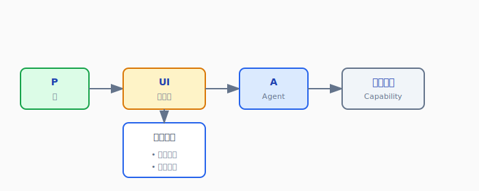
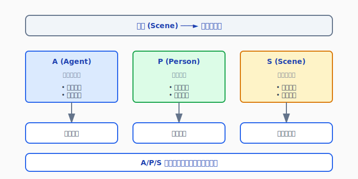
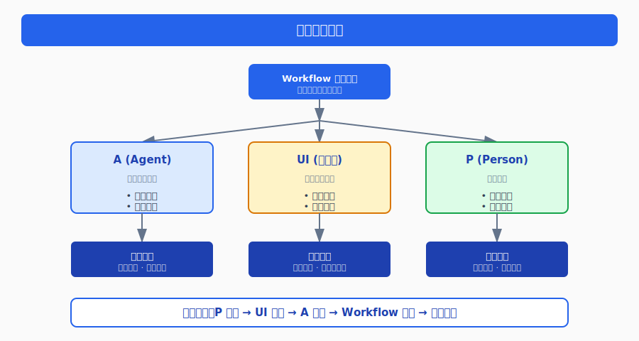
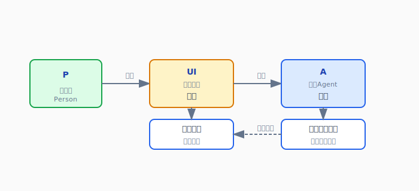
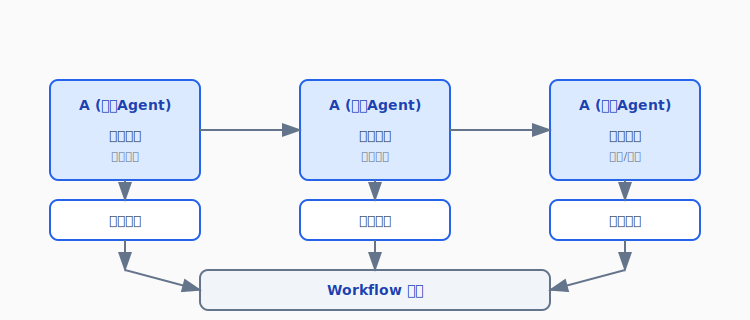

# OoderAgent 能力架构：基于 Workflow 控制理论的能力安装管理

## 摘要

本文系统阐述了 OoderAgent 能力架构的核心设计理念——以**能力安装管理控制**为中心，通过 Workflow 控制理论实现能力的"驯化"与可控可用。文章揭示了能力架构的本质：P2P、A2PM、P2A、A2A 四种协作模式，以及 Workflow 如何从传统的 P2P 数据流转转变为 A/UI/P 三元结构控制机制。通过场景与活动的创新映射（A/P/S 拆分），实现了能力的动态适配与精准控制，为企业级应用提供了全新的架构范式。

---

## 一、能力架构的本质

### 1.1 什么是能力架构

能力架构是 OoderAgent 的核心设计理念，它将系统功能抽象为独立的"能力"单元，并通过四种协作模式实现能力的互联互通：

```
┌─────────────────────────────────────────────────────────────┐
│                    能力架构协作模式                          │
├─────────────────────────────────────────────────────────────┤
│                                                             │
│   P ────────────────────────────────────────────────── P    │
│   │                      P2P                            │   │
│   │              (人与人协作)                           │   │
│   │                                                    │   │
│   │    ┌──────────┐              ┌──────────┐         │   │
│   │    │   UI     │◄────────────►│   UI     │         │   │
│   │    │ (翻译层) │              │ (翻译层) │         │   │
│   │    └────┬─────┘              └────┬─────┘         │   │
│   │         │                         │               │   │
│   │         ▼                         ▼               │   │
│   │    ┌──────────┐              ┌──────────┐         │   │
│   │    │ Agent    │◄────────────►│ Agent    │         │   │
│   │    │  (A)     │    A2A       │  (A)     │         │   │
│   │    └────┬─────┘              └────┬─────┘         │   │
│   │         │                         │               │   │
│   │         │         A2PM            │               │   │
│   │         └────────────┬────────────┘               │   │
│   │                      │                            │   │
│   │                      ▼                            │   │
│   │              ┌──────────────┐                     │   │
│   │              │ Process      │                     │   │
│   │              │ Manager      │                     │   │
│   │              └──────────────┘                     │   │
│   │                                                   │   │
│   P2A: 人与Agent交互 (通过UI翻译)                     P   │
│                                                             │
└─────────────────────────────────────────────────────────────┘
```

### 1.2 四种协作模式详解

| 协作模式 | 全称 | 说明 | 翻译需求 |
|---------|------|------|---------|
| **P2P** | Person to Person | 人与人之间的直接协作 | 需要 UI 翻译 |
| **P2A** | Person to Agent | 人与 Agent 的交互 | 需要 UI/A2UI 翻译 |
| **A2A** | Agent to Agent | Agent 之间的自动协作 | 无需翻译 |
| **A2PM** | Agent to Process Manager | Agent 与流程管理的交互 | 无需翻译 |

### 1.3 UI/A2UI 的翻译作用

**核心原理**：所有涉及 P（Person）的协作都需要通过 UI 进行翻译。



**A2UI 的作用**：
- 自动生成翻译界面
- 动态适配不同能力
- 实现人机交互的标准化

---

## 二、为什么需要 Workflow

### 2.1 协作规则的本质

Workflow 不是简单的流程引擎，而是**协作规则的定义与管理机制**。

**核心问题**：
- 能力是开放的、不可控的
- 不同能力之间的协作需要规则约束
- 业务场景需要特定的协作模式

**Workflow 的解决方案**：
```
开放能力 + Workflow 规则 = 可控可用的能力组合
```

### 2.2 Workflow 的控制理论

传统 Workflow 是 P2P 数据流转：

```
传统模式：
┌───┐     ┌───┐     ┌───┐
│ P │────►│ P │────►│ P │
└───┘     └───┘     └───┘
  人       人        人
数据流转   数据流转   数据流转
```

OoderAgent Workflow 是 A/UI/P 三元结构控制：

```
创新模式：
                    ┌─────────────────────────────┐
                    │      Workflow 控制中心       │
                    │                             │
                    │   ┌───┐   ┌───┐   ┌───┐   │
                    │   │ A │   │UI │   │ P │   │
                    │   └─┬─┘   └─┬─┘   └─┬─┘   │
                    │     │       │       │     │
                    │     └───────┴───────┘     │
                    │           │               │
                    │           ▼               │
                    │    ┌─────────────┐        │
                    │    │  能力控制    │        │
                    │    └─────────────┘        │
                    └─────────────────────────────┘
```

### 2.3 A (Agent) 的统一整合

Agent 统一了传统分散的概念：

| 传统概念 | Agent 整合 |
|---------|-----------|
| 事件 (Event) | Agent 事件处理 |
| 自动任务 (Auto Task) | Agent 自动执行 |
| 业务调用整合 | Agent 能力编排 |
| 消息通知 | Agent 通信机制 |
| 状态管理 | Agent 状态机 |

**统一后的优势**：
- 单一入口，统一管理
- 状态可追踪，行为可审计
- 能力可组合，流程可编排

---

## 三、能力为什么需要 Workflow

### 3.1 能力的开放性与不可控性

**能力的特点**：
- **开放性**：能力来自不同来源，接口各异
- **独立性**：能力独立部署，独立运行
- **不可控性**：能力行为不可预测，需要约束

**问题示例**：
```
能力 A：发送邮件
能力 B：更新数据库
能力 C：调用外部 API

问题：
- 谁先执行？谁后执行？
- 失败了怎么办？
- 如何保证数据一致性？
- 如何审计追踪？
```

### 3.2 Workflow 的"驯化"作用

Workflow 通过适配实现能力的"驯化"：

```
┌─────────────────────────────────────────────────────────────┐
│                    能力驯化过程                              │
├─────────────────────────────────────────────────────────────┤
│                                                             │
│  ┌──────────┐     ┌──────────┐     ┌──────────┐           │
│  │ 开放能力  │────►│Workflow  │────►│ 可控能力  │           │
│  │ (不可控) │     │  适配    │     │ (可控可用)│           │
│  └──────────┘     └──────────┘     └──────────┘           │
│                                                             │
│  适配内容：                                                 │
│  ├── 输入约束：参数验证、格式转换                          │
│  ├── 输出规范：结果标准化、错误处理                        │
│  ├── 执行控制：超时、重试、回滚                            │
│  ├── 状态管理：进度追踪、状态同步                          │
│  └── 审计日志：操作记录、行为追踪                          │
│                                                             │
└─────────────────────────────────────────────────────────────┘
```

### 3.3 能力安装的 Workflow 适配

能力安装时的 Workflow 适配流程：

```
能力安装流程：

1. 能力发现
   └── 扫描能力元数据
   └── 解析能力接口

2. Workflow 适配
   └── 创建能力适配器
   └── 定义输入输出规范
   └── 配置执行策略

3. 场景绑定
   └── 关联业务场景
   └── 配置触发条件
   └── 设置权限控制

4. 可用性验证
   └── 测试能力执行
   └── 验证控制效果
   └── 确认可用状态
```

---

## 四、场景与活动的映射创新

### 4.1 传统活动模型

传统 BPM 的活动模型：

```
流程 (Process)
├── 活动 (Activity)
│   ├── 用户任务
│   ├── 服务任务
│   └── 脚本任务
└── 网关 (Gateway)
    ├── 排他网关
    ├── 并行网关
    └── 包容网关
```

### 4.2 OoderAgent 的创新：A/P/S 拆分

OoderAgent 将活动拆分为三个维度：



### 4.3 A/P/S 映射关系

```
┌─────────────────────────────────────────────────────────────┐
│                    场景与活动映射                            │
├─────────────────────────────────────────────────────────────┤
│                                                             │
│   场景 (Scene)                                              │
│   ┌─────────────────────────────────────────────────────┐  │
│   │                                                     │  │
│   │   活动块 1              活动块 2              活动块 3 │  │
│   │   ┌─────────┐         ┌─────────┐         ┌─────────┐│  │
│   │   │    A    │────────►│    P    │────────►│    S    ││  │
│   │   │ (Agent) │         │ (Person)│         │ (Scene) ││  │
│   │   └─────────┘         └─────────┘         └─────────┘│  │
│   │       │                   │                   │      │  │
│   │       ▼                   ▼                   ▼      │  │
│   │   自动执行            人工审批           子场景嵌套   │  │
│   │   能力调用            数据录入           流程复用     │  │
│   │   事件处理            异常处理           模块组合     │  │
│   │                                                     │  │
│   └─────────────────────────────────────────────────────┘  │
│                                                             │
└─────────────────────────────────────────────────────────────┘
```

### 4.4 设计理念创新

| 传统模式 | OoderAgent 模式 | 创新点 |
|---------|----------------|-------|
| 活动类型固定 | A/P/S 动态组合 | 灵活性 |
| 流程线性执行 | 场景嵌套复用 | 模块化 |
| 人工任务单一 | P 支持多种交互 | 丰富性 |
| 自动任务分散 | A 统一管理 | 一致性 |

---

## 五、Workflow 控制理论的核心机制

### 5.1 三元控制结构



### 5.2 控制流程

```
控制流程：

1. 触发阶段
   P 发起请求 ──► UI 翻译 ──► A 接收 ──► Workflow 路由

2. 执行阶段
   Workflow 分发 ──► A 执行能力 ──► 结果返回 ──► UI 呈现

3. 决策阶段
   A 提供选项 ──► UI 展示 ──► P 决策 ──► A 继续执行

4. 完成阶段
   A 完成任务 ──► Workflow 归档 ──► UI 通知 ──► P 确认
```

### 5.3 控制规则

**输入控制**：
- 参数验证
- 格式转换
- 权限检查

**执行控制**：
- 超时管理
- 重试策略
- 并发控制

**输出控制**：
- 结果标准化
- 错误处理
- 状态同步

---

## 六、能力安装管理控制

### 6.1 能力生命周期

```
┌─────────────────────────────────────────────────────────────┐
│                    能力生命周期                              │
├─────────────────────────────────────────────────────────────┤
│                                                             │
│   ┌─────────┐    ┌─────────┐    ┌─────────┐    ┌─────────┐│
│   │  发现   │───►│  安装   │───►│  适配   │───►│  可用   ││
│   │Discover │    │ Install │    │ Adapt   │    │ Usable  ││
│   └─────────┘    └─────────┘    └─────────┘    └─────────┘│
│        │              │              │              │      │
│        ▼              ▼              ▼              ▼      │
│   扫描元数据     部署能力包    Workflow适配    启用能力     │
│   解析接口       注册能力      创建适配器      验证可用     │
│   检查依赖       配置权限      绑定场景        监控运行     │
│                                                             │
│   ┌─────────┐    ┌─────────┐    ┌─────────┐               │
│   │  运行   │───►│  监控   │───►│  废弃   │               │
│   │  Run    │    │ Monitor │    │ Deprecate│               │
│   └─────────┘    └─────────┘    └─────────┘               │
│        │              │              │                     │
│        ▼              ▼              ▼                     │
│   执行能力       收集指标      停止服务                     │
│   处理请求       分析日志      清理资源                     │
│   响应事件       告警通知      归档数据                     │
│                                                             │
└─────────────────────────────────────────────────────────────┘
```

### 6.2 能力安装流程

```yaml
# 能力安装配置
capability:
  id: email-send
  name: 发送邮件
  version: 1.0.0
  
  # 安装前检查
  preInstall:
    - checkDependencies
    - validateConfig
    - testConnection
    
  # Workflow 适配
  workflowAdaptation:
    # 输入适配
    inputAdapter:
      validate: true
      transform: email-format-transformer
      
    # 输出适配
    outputAdapter:
      standardize: true
      errorHandler: email-error-handler
      
    # 执行适配
    executionAdapter:
      timeout: 30s
      retry: 3
      fallback: queue-email
      
  # 场景绑定
  sceneBinding:
    - sceneId: approval-notification
      trigger: workflow.completed
      priority: high
      
    - sceneId: alert-notification
      trigger: system.alert
      priority: critical
```

### 6.3 能力控制矩阵

| 控制维度 | 控制项 | 控制方式 | 控制效果 |
|---------|-------|---------|---------|
| **输入控制** | 参数验证 | Schema 校验 | 数据完整性 |
| | 格式转换 | 适配器模式 | 接口兼容性 |
| | 权限检查 | RBAC | 访问安全性 |
| **执行控制** | 超时管理 | 超时配置 | 资源保护 |
| | 重试策略 | 指数退避 | 容错能力 |
| | 并发控制 | 信号量 | 性能稳定 |
| **输出控制** | 结果标准化 | 响应模板 | 接口统一 |
| | 错误处理 | 异常捕获 | 健壮性 |
| | 状态同步 | 事件通知 | 一致性 |

---

## 七、实际应用场景

### 场景一：能力安装与适配

**用户故事**：系统管理员需要安装一个新的"短信发送"能力。

**流程**：

```
1. 能力发现
   └── 扫描短信能力包
   └── 解析接口定义
   └── 检查依赖项

2. Workflow 适配
   └── 创建输入适配器（手机号格式验证）
   └── 创建输出适配器（发送结果标准化）
   └── 配置执行策略（超时10秒，重试2次）

3. 场景绑定
   └── 绑定到"验证码发送"场景
   └── 绑定到"告警通知"场景

4. 可用性验证
   └── 测试发送验证码
   └── 验证结果返回
   └── 确认可用状态
```

### 场景二：P2A 协作控制

**用户故事**：审批人员需要通过界面审批采购申请。

**协作流程**：



### 场景三：A2A 自动协作

**用户故事**：订单创建后自动触发库存检查和通知发送。

**协作流程**：



---

## 八、设计理念总结

### 8.1 核心创新点

| 创新点 | 传统方式 | OoderAgent 方式 |
|-------|---------|----------------|
| **协作模式** | P2P 数据流转 | A/UI/P 三元控制 |
| **活动模型** | 固定活动类型 | A/P/S 动态组合 |
| **能力管理** | 直接使用 | Workflow 适配驯化 |
| **Agent 定位** | 分散概念 | 统一整合中心 |

### 8.2 核心价值

1. **可控性**：开放能力通过 Workflow 适配变为可控
2. **灵活性**：A/P/S 组合支持复杂业务场景
3. **一致性**：Agent 统一管理，接口标准统一
4. **可追溯**：全流程审计，行为可追踪

### 8.3 架构优势

```
能力开放性 + Workflow 控制理论 = 可控可用的能力生态
```

---

## 九、附录

### A. 关键概念对照表

| 概念 | 说明 |
|-----|------|
| P (Person) | 人，系统的使用者 |
| A (Agent) | Agent，统一的能力执行单元 |
| UI | 用户界面，P 与 A 的翻译层 |
| A2UI | 自动生成 UI 的能力 |
| Scene | 场景，业务流程的抽象 |
| Workflow | 工作流，协作规则的定义 |
| Capability | 能力，系统功能的抽象单元 |

### B. 技术栈

| 技术领域 | 技术选型 |
|---------|---------|
| 后端框架 | Java 21, Spring Boot |
| 前端框架 | Vue 3, Element Plus |
| 工作流引擎 | ooder-bpm-web |
| AI 能力 | LLM Integration |
| 数据存储 | SQLite |
| 缓存服务 | Redis |

### C. 关键文件路径

- **Workflow 场景**: `E:\github\ooder-skills\temp\ooder-Nexus\src\main\resources\scenes\workflow-scene.yaml`
- **A2UI 场景**: `E:\github\ooder-skills\temp\ooder-Nexus\src\main\resources\scenes\a2ui-scene.yaml`
- **能力模型**: `E:\github\ooder-skills\mvp\src\main\java\net\ooder\mvp\skill\scene\capability\model\Capability.java`

---

**文档版本**：v3.0  
**创建日期**：2026-04-06  
**作者**：Ooder Team  
**项目路径**：E:\github\ooder-skills
