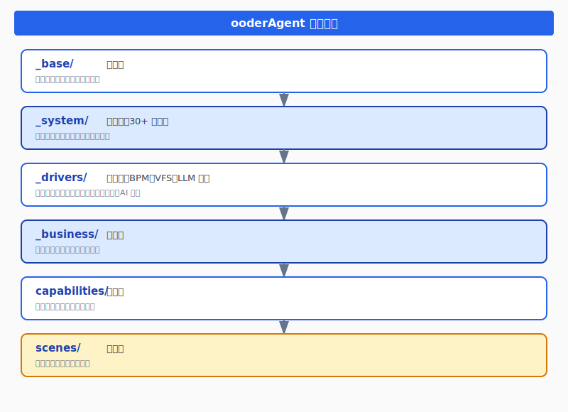

# HTML 版本博文生成完成

## 生成的文件

### 主文件
- **文件路径**: `e:\github\ooder-skills\skills\_drivers\bpm\docs\从零开始的 SPAC 编程构建 BPM 设计器实战 - 最终版.html`
- **文件大小**: 35,071 字节
- **文件状态**: ✅ 已完成，已在浏览器中打开预览

### SVG 图表文件
所有 SVG 图表已生成在 `diagrams/` 目录下：

1. **skill_architecture.svg** (3,488 字节) - ooderAgent 技能架构图
2. **llm_agent_architecture.svg** (3,428 字节) - LLM Agent 架构图
3. **migration_strategy.svg** (4,666 字节) - 插件迁移策略图
4. **plugin_architecture.svg** (4,361 字节) - 插件架构与事件总线图
5. **h5js_advantages.svg** (1,834 字节) - H5 JS 优势图
6. **llm_workflow.svg** (3,629 字节) - LLM 工作流程图
7. **permission_flow.svg** (4,230 字节) - 权限流程图
8. **scene_architecture.svg** (3,879 字节) - 场景架构图
9. **storage_architecture.svg** (3,747 字节) - 存储架构图
10. **swing_challenges.svg** (1,861 字节) - Swing 挑战图
11. **tech_stack.svg** (4,061 字节) - 技术栈图
12. **version_lifecycle.svg** (3,908 字节) - 版本生命周期图

## HTML 文件特点

### 1. 响应式设计
- ✅ 支持桌面端和移动端
- ✅ 自适应布局，最大宽度 1200px
- ✅ 媒体查询优化小屏幕显示

### 2. 样式特性
- ✅ 使用 CSS 变量定义主题色
- ✅ 渐变标题背景
- ✅ 粘性导航栏
- ✅ 代码块高亮显示
- ✅ 表格美化样式
- ✅ 引用块样式
- ✅ 提示框样式（成功、警告、高亮）

### 3. 内容结构
- ✅ 完整的 5 个章节
  - 第 1 节：缘起：为什么需要重构？
  - 第 2 节：对话：架构如何设计？
  - 第 3 节：实战：NLP 插件如何构建？
  - 第 4 节：难点：插件迁移的挑战
  - 第 5 节：成果：1 周的奇迹
- ✅ 摘要和前言
- ✅ 写在最后
- ✅ 页脚信息（项目地址、开源协议、Maven 仓库）

### 4. 界面截图预留
HTML 文件中已预留 3 个界面截图位置：
1. trae sole 对话界面 - 第一次架构设计讨论
2. NLP 插件对话界面 - 自然语言创建流程
3. 最终 BPM 设计器界面 - 100+ 插件全部加载

截图位置使用虚线边框的占位符表示，方便后续添加实际截图。

### 5. SVG 图表引用
HTML 中引用了以下 SVG 图表：
- `diagrams/skill_architecture.svg` - 第 1 节
- `diagrams/llm_agent_architecture.svg` - 第 3 节
- `diagrams/migration_strategy.svg` - 第 4 节
- `diagrams/plugin_architecture.svg` - 第 4 节

## 文件访问方式

### 本地访问
直接双击 HTML 文件即可在浏览器中打开：
```
e:\github\ooder-skills\skills\_drivers\bpm\docs\从零开始的 SPAC 编程构建 BPM 设计器实战 - 最终版.html
```

### 相对路径
所有 SVG 图表使用相对路径引用，确保在移动文件时保持目录结构：
```html

```

## 后续工作建议

### 1. 添加界面截图
在以下位置添加实际截图：
- 第 2 节：trae sole 对话界面
- 第 3 节：NLP 插件对话界面
- 第 5 节：最终 BPM 设计器界面

替换方法：将 `<div class="screenshot-placeholder">...</div>` 替换为实际的 `` 标签。

### 2. 测试浏览器兼容性
建议在以下浏览器中测试：
- Chrome
- Firefox
- Edge
- Safari

### 3. 打印优化
已包含打印样式，但建议实际测试打印效果。

### 4. 发布准备
如需发布到博客平台，可能需要：
- 压缩图片
- 内联 CSS
- 优化 SEO

## 技术细节

### CSS 框架
- 无外部依赖，纯原生 CSS
- 使用 CSS 变量实现主题化
- 响应式设计使用媒体查询

### 字体
- 使用系统字体栈
- 优先使用 Apple System, BlinkMacSystemFont
- 降级字体：Segoe UI, Roboto, Helvetica Neue, Arial

### 颜色方案
- 主色：#2563eb (蓝色)
- 辅色：#1e40af (深蓝)
- 背景色：#f8fafc (浅灰)
- 文字色：#334155 (深灰)
- 代码背景：#f1f5f9 (极浅灰)
- 高亮背景：#dbeafe (浅蓝)
- 警告背景：#fef3c7 (浅黄)
- 成功背景：#d1fae5 (浅绿)

## 文件清单

```
docs/
├── 从零开始的 SPAC 编程构建 BPM 设计器实战 - 最终版.html (35,071 字节) ✅
├── 从零开始的 SPAC 编程构建 BPM 设计器实战 - 最终版.md (23,178 字节)
└── diagrams/
    ├── skill_architecture.svg ✅
    ├── llm_agent_architecture.svg ✅
    ├── migration_strategy.svg ✅
    ├── plugin_architecture.svg ✅
    ├── h5js_advantages.svg
    ├── llm_workflow.svg
    ├── permission_flow.svg
    ├── scene_architecture.svg
    ├── storage_architecture.svg
    ├── swing_challenges.svg
    ├── tech_stack.svg
    └── version_lifecycle.svg
```

## 完成时间
2026-04-12

## 备注
- 所有代码采用 MIT 开源协议
- 支持 Maven 中央仓库引入
- 项目地址：https://github.com/ooder/ooder-skills
